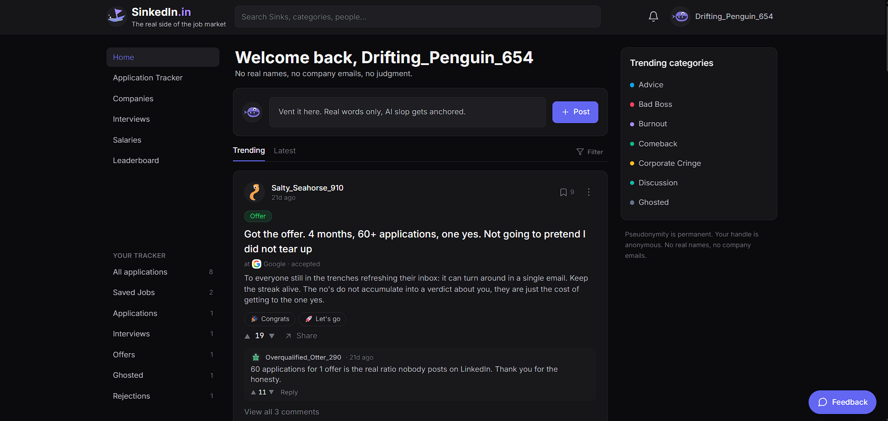
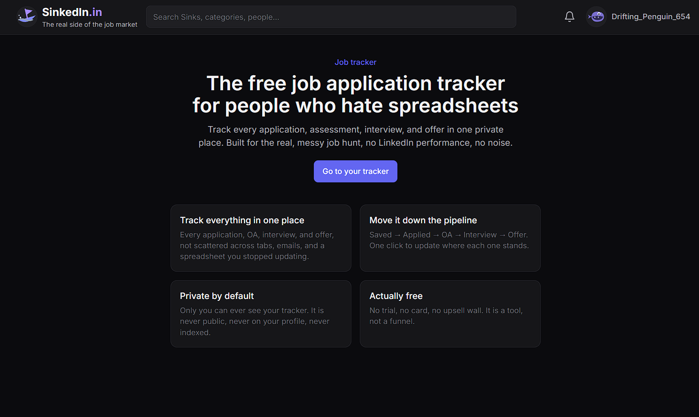
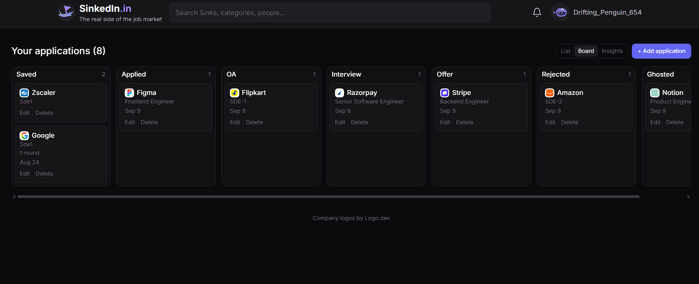
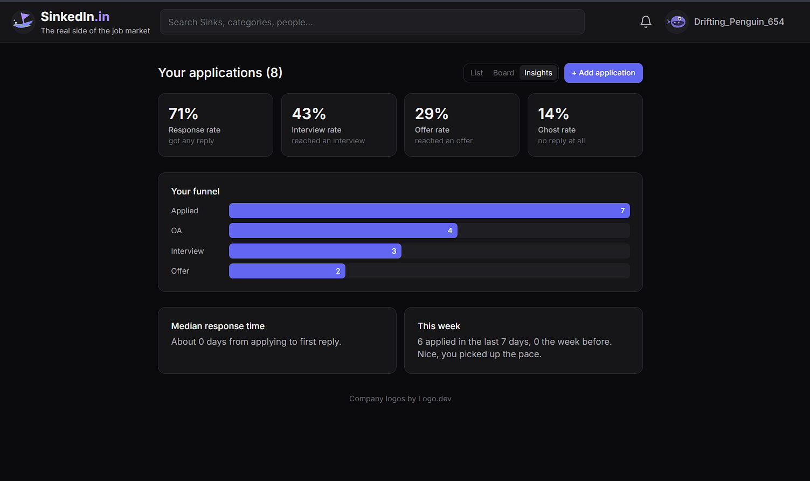
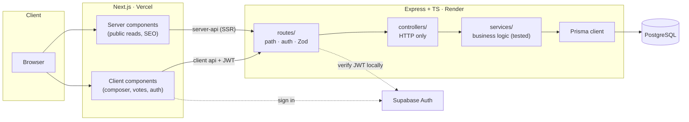

<div align="center">

# 🌊 SinkedIn

**The real side of the job market.**

A pseudonymous, darkly-funny community for the honest half of work and the job hunt: the rejections, the ghostings, the layoffs, the comebacks. Plus a private tracker so you can actually manage your search, not just vent about it.

[](https://sinkedin.in)


</div>

---

## What it is

Everyone posts their wins on LinkedIn. Nobody posts the 60 rejections it took to get there. SinkedIn is the place for the part people leave out, told honestly and (mostly) with a sense of humor.

You post a **Sink** (a short, categorized story: a bad-boss rant, a rejection, a raise, a small win), the community reacts with **buoys** (up), **anchors** (down), threaded comments, and one-tap solidarity reactions. Everyone is pseudonymous: a persistent sea-creature handle like `Rejected_Raccoon_402`, never a real name.

Alongside the public feed sits a **private job tracker**: log every application, watch your funnel and response rate, attach the exact resume you used, and, when you finally land the thing, post a **Comeback**.

> Pseudonymity is permanent. No real names, no company emails. The private tracker is a separate world that never leaks into the public one.

## Screenshots

<p align="center">
  
  
</p>
<p align="center">
  
  
</p>

_See it live at **[sinkedin.in](https://sinkedin.in)**._

## Where things stand

SinkedIn is **live at [sinkedin.in](https://sinkedin.in)** with the full community loop and the private job tracker working end to end. It is built in disciplined phases (see the [roadmap](#roadmap)): Phases 0 and 1 are complete, Phase 2 (retention + the tracker) is nearly complete, and Phases 3 onward are planned. Below, "Available today" is what actually ships right now; "On the roadmap" is what is coming next.

## Features

### Available today

**The community loop**
- Post a **Sink** with a category-first composer (the category reveals only its relevant fields: company, outcome, poll).
- **Buoys / Anchors** voting (server-clamped so a stale client can never swing a score by two).
- Threaded **comments** with their own voting, read and replied to inline in the feed.
- **Polls**, one-tap **reactions** (config-driven per category), **bookmarks**, image uploads.
- **In-app notifications**: replies, and milestone pings ("your Sink hit 25 buoys") rather than one ping per vote.
- Pseudonymous **profiles** and handle picker, with a blocklist and an anonymity nudge.
- Light-touch **moderation**: report, rate limits, soft-delete everywhere.

**The private job tracker** (owner-only, real data, never indexed)
- Track applications through a real funnel (Saved → Applied → OA → Interview → Offer / Rejected / Ghosted).
- **List** and **kanban board** views, per-application **interview rounds**, a "quiet for N days" nudge on stalled applications.
- **Personal insights**: response rate, ghost rate, interview and offer rates, median response time, which resume gets the most replies.
- **Resume per application** (private storage, PDF only, signed-URL downloads).
- **Comeback flow**: mark an offer, get a confetti moment and a pre-filled "post your Comeback" nudge built from your real numbers.
- One-way **"post as a Sink"** bridge (you choose what becomes public; private notes never cross).
- **Data export** (CSV / JSON) and a full **delete** of your tracker data, because it holds real PII.

**Shared**
- Centralized **Company** entity with real logos, powering autocomplete and (soon) company pages.
- Server-rendered public pages for **SEO** and social share previews.

### On the roadmap

Planned and designed, gated behind proving each earlier phase. Nothing here is live yet.

- **Weekly digest email**: an on-brand "your week in the trenches" recap (your own numbers) plus the best community posts of the week. One weekly email, never per-event spam.
- **Companion Chrome extension**: one-click **"save this job to my tracker"** from any job page (reads the page's structured data), an **"already applied here"** warning, and later a **community overlay** that surfaces SinkedIn intel (ghost rate, interview experiences) right on the job posting. Further out, opt-in **autofill** of applications from a private profile you control (review-then-submit, never automatic).
- **Interview-Experience SEO hub**: structured, searchable interview write-ups per company and role, built to bring people in from Google.
- **Company pages**: everything the community has said about a company, plus honest, opt-in, privacy-safe aggregate signals (ghost rate, response time) once there is enough data to be fair.
- **Discovery + follow**: hot / rising sorts, full-text search, and following categories or people for a personalized feed.
- **Referrals**: ask for and give referrals, gated behind verifying you actually work somewhere, with a minimal, consent-based identity handoff and reputation ("Auras") for helping, never money.
- **Trust + gamification**: verified Sinks (prove a rejection or offer is real without revealing who you are), **Auras** for helping and persistence, and resilience streaks. Never a "most rejected" scoreboard.
- **Shareable cards**, including a **"Year in the Trenches"** annual recap built for sharing.
- **AI (last, and optional)**: paste a rejection email to auto-draft a post you confirm, decode corporate-speak, and instant commiseration. Always additive, the manual flow always works.

_Full detail, decisions, and the guardrails for each live in [`docs/roadmap/`](docs/roadmap/README.md)._

## Tech stack

TypeScript end to end, no second language or runtime anywhere.

| Layer | Choices and details |
|---|---|
| **Frontend** | **Next.js (App Router)** + **React** + **TypeScript** + **Tailwind CSS**. Public reads are **server components** (real HTML + per-page OpenGraph metadata for SEO and share previews); interactive pieces (composer, vote controls, auth modal, notification bell) are client components. |
| **Backend** | **Node + Express + TypeScript** in strict layers: `routes` (path, auth, Zod) → `controllers` (HTTP only) → `services` (all business logic, unit-tested) → Prisma. **Zod** validates every request body; category-conditional fields are validated in the service. Per-route **rate limiting** on writes. |
| **Database** | **PostgreSQL** via the **Prisma** ORM (the schema is the single source of truth). Soft-deletes everywhere (`deletedAt`, never hard-delete), fixed **enums** for closed sets, typed columns + FKs for anything queried, `jsonb` only for opaque payloads. Migrations run automatically on deploy via a GitHub Action. |
| **Auth** | **Supabase Auth**. The backend verifies the JWT **locally** (HS256 secret or asymmetric JWKS), so there is no network round-trip to Supabase on every authenticated request. Public identity is a pseudonymous handle only, real identity never leaves the backend. |
| **Storage** | **Supabase Storage**: a public `sink-media` bucket for post images, and a **private `resumes` bucket** with row-level security (each user confined to their own folder) served through short-lived signed URLs. |
| **Email** | **Resend** via a dependency-free HTTP wrapper that is a safe no-op until a key is set. |
| **External** | **Logo.dev** for company logos by domain (nothing stored). |
| **Testing** | **Vitest**, service-layer tests running against an isolated test database. |
| **CI / CD** | **GitHub Actions** (tests on push, `prisma migrate deploy` to prod on merges to `main`). **Vercel** and **Render** auto-deploy from `main`. |
| **Hosting** | Vercel (frontend, Mumbai), Render (backend, Singapore), Supabase (Postgres + Auth + Storage, Mumbai). All free tier. A keep-warm cron avoids free-tier cold starts. |

**A few decisions worth calling out:**
- **Public-first, not a login wall.** The whole app renders for everyone; sign-in is prompted only on an action (post, vote, comment) via a modal, so the community is fully readable and indexable.
- **The pseudonymity wall is enforced in code**, not by convention: public queries `select` only safe fields, and the private tracker is a separate set of models never joined into a public response.
- **Server-clamped voting.** The client sends only a direction; the server clamps each user's contribution to a single step, so a stale client can never swing a score by two.
- **Capture data from day one.** Status-change history is recorded per application so personal analytics (response time, ghost rate, interview rate) stay reconstructable, even though most of it is not surfaced yet.

## Architecture

Every backend request flows through the same strict layering, and Prisma is only ever touched in the service layer:



The **pseudonymity wall** is enforced in code: public API responses `select` only safe fields, so `email` / `supabaseUserId` / real identity never leave the backend. The private tracker is a separate set of models that is never included in any public response.

## Local development

**Prerequisites:** Node 20+, Docker (for local Postgres), and a free [Supabase](https://supabase.com) project (Auth + Storage).

**1. Install**
```bash
git clone https://github.com/twarangupta/SinkedIn.git
cd SinkedIn
cd backend && npm install
cd ../frontend && npm install
```

**2. Configure env**
```bash
# copy the templates, then fill in your Supabase values
cp backend/.env.example backend/.env
cp frontend/.env.example frontend/.env
```
Each `.env.example` documents exactly what every variable is and where to find it. Nothing secret is committed.

**3. Start Postgres (Docker)**
```bash
docker run -d --name sinkedin-postgres \
  -e POSTGRES_PASSWORD=postgres -e POSTGRES_DB=sinkedin \
  -p 5434:5432 postgres:16
```

**4. Migrate + seed**
```bash
cd backend
npx prisma migrate deploy          # apply the schema
npm run db:seed:companies          # ~9.6k companies for autocomplete/logos
npm run db:seed:demo               # optional: demo Sinks so the feed feels alive
```

**5. Run (two terminals)**
```bash
cd backend  && npm run dev   # http://localhost:4000
cd frontend && npm run dev   # http://localhost:5173
```

Full functionality also needs two Supabase Storage buckets: `sink-media` (public, for post images) and `resumes` (private, for the tracker). See `CLAUDE.md` for the details.

## Project structure

```
backend/
  prisma/            schema (source of truth) · migrations · seeds
  src/
    routes/          endpoint definitions + middleware wiring
    controllers/     HTTP in/out only
    services/        all business logic (unit-tested)
    lib/             prisma client, auth, storage helpers
frontend/
  src/
    app/             App Router pages (server-rendered public reads)
    components/      presentational + client components
    lib/             API clients, auth, providers
docs/
  roadmap/           the phase-by-phase plan (see below)
```

## Testing

```bash
cd backend && npm test      # Vitest, runs against an isolated test database
```
Every service function has a test; the suite runs on every push in CI.

## Roadmap

Built in disciplined phases, each with an honest exit gate before the next begins. The full plan lives in [`docs/roadmap/`](docs/roadmap/README.md).

| Phase | Focus | Status |
|---|---|---|
| 0 | Foundation (deployed skeleton, all layers wired) | ✅ done |
| 1 | Core loop (post, feed, vote, comment, poll, react) | ✅ done |
| 2 | Retention (private tracker, insights, notifications, resumes) | 🟢 nearly complete |
| 3 | Depth & growth (discovery, interview-experience SEO hub, company pages) | ⬜ planned |
| 4 | Trust & gamification (verified Sinks, Auras, ranks) | ⬜ planned |
| 5 | Growth mechanics (shareable cards) | ⬜ planned |
| 6+ | AI & monetization | ⬜ planned |

## License

**Proprietary. All rights reserved.** This source is published for portfolio and reference purposes only. You may not copy, reuse, redistribute, or create derivative works from it without explicit written permission. It is not open source.

---

<div align="center">
<sub>Built by <a href="https://github.com/twarangupta">Twaran Gupta</a>.</sub>
</div>
