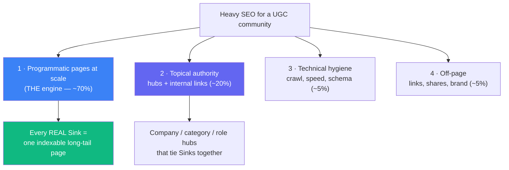
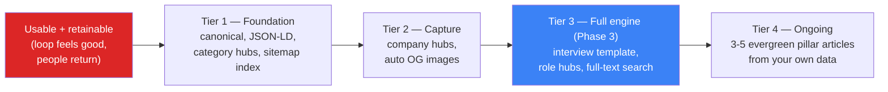
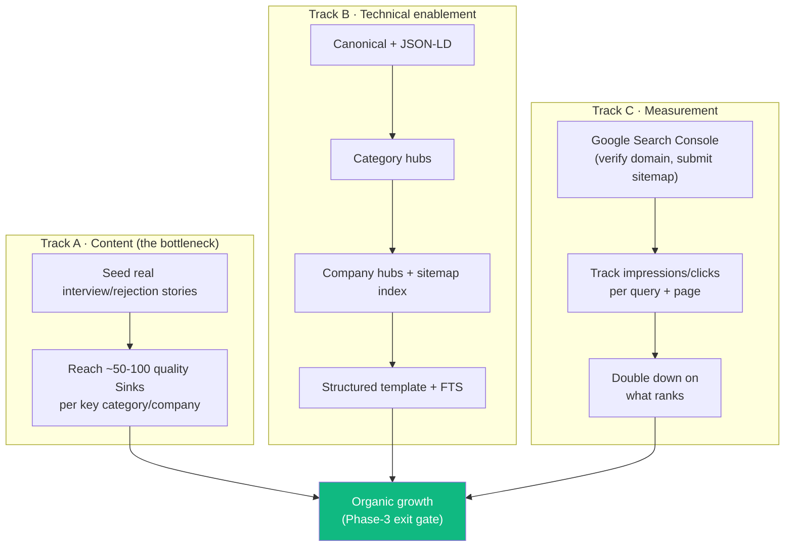

# SinkedIn — SEO Strategy

> **Status:** Planning doc. Not to be implemented yet.
> **Precondition (read this first):** Do **not** start heavy SEO until SinkedIn is a *usable and retainable* product — i.e. the Phase‑1 core loop feels good AND early Phase‑2 retention is showing (people come back without being pushed). SEO sends strangers to your door; if the house isn't worth staying in, you're paying (in effort) to fill a leaky bucket. **Content + retention first, distribution second.** This doc is the map for when that day comes.

← Related: [`3_Retention_Features.md`](3_Retention_Features.md) · [`roadmap/phase-3-depth-and-growth.md`](roadmap/phase-3-depth-and-growth.md)

---

## 0. The one honest truth up front

**You cannot rank for the bare term "linkedin."** It's a defended trademark owned by a company with enormous domain authority; no new site out‑ranks the owner for its own brand name. Chasing it wastes effort. ("anti‑LinkedIn" also stays an *internal compass only* — never public copy, trademark risk.)

**The real free traffic engine is long‑tail, high‑intent, low‑competition queries** that nobody answers well with a human voice:

- `razorpay sde-1 interview experience`
- `got rejected after final round stories`
- `amazon india hiring process 2026`
- `how to know if a job offer got ghosted`
- `bad boss stories reddit` (and the many `[company] + [emotion/event]` combinations)

These are queries real people type at 2am. They compound slowly and durably. This is validated at scale — **AmbitionBox (~6.4M visits/mo)** and **GeeksforGeeks (~35M/mo)** were built largely on exactly this search intent. They're soulless data dumps. **SinkedIn's wedge is the same SEO surface wrapped in a community with a voice.**

---

## 1. Mental model — the four surfaces of "heavy SEO"

Heavy SEO means winning on four surfaces at once. For a **user‑generated‑content (UGC) community** like SinkedIn they are weighted very unequally — most of your durable free traffic comes from surfaces 1 and 2.

**The uncomfortable core truth:** heavy SEO is **not one big feature.** It is *volume of real content × topical structure × patience.* The technical work below only removes friction so Google can find and trust the stories — **you still need the stories.** No amount of schema markup ranks an empty site.

---

## 2. What already exists (the groundwork — don't rebuild it)

As of this writing the foundation is already in place:

| Built | Where |
|---|---|
| SSR on `/` (feed) and `/s/[id]` (single Sink) | `frontend/src/app/` |
| Per‑Sink `<title>` + OpenGraph via `generateMetadata` | `frontend/src/app/s/[id]/page.tsx` |
| DB‑driven `/sitemap.xml` (lists `/` + every `/s/:id`, with `lastmod`) | `backend/src/routes/sitemap.routes.ts` |
| `robots.txt` allowing all + pointing at the sitemap | `frontend/public/robots.txt` |
| GA4 analytics (`G-NQGVS7VTS1`) | `frontend/src/app/layout.tsx` |

**Not yet done:** canonical tags, `metadataBase`, JSON‑LD structured data, OG images, category/company hubs, sitemap index, structured interview template, full‑text search.

---

## 3. Every idea, bucketed (the *what* and the *why*)

### A. Programmatic UGC pages — the core engine (highest ROI)

| Idea | What | Why |
|---|---|---|
| Per‑Sink meta/OG/canonical | Every Sink page ships a unique title, description, canonical URL, OG card | A canonical tag prevents duplicate‑content dilution; unique meta is how each page targets its own long‑tail query. *(meta/OG partly done; canonical + `metadataBase` still needed.)* |
| JSON‑LD structured data | Add `DiscussionForumPosting` / `QAPage` schema + `BreadcrumbList` per Sink | Tells Google *"this is a real discussion/Q&A with an author and answers,"* unlocking richer results and better topical understanding. A few lines inside the existing `generateMetadata`. |
| **Structured Interview‑Experience template** | A category‑specific template capturing company, role, rounds, difficulty, stage reached, outcome, questions asked | **The single biggest keyword unlock.** Structured, repeatable pages targeting `[company] [role] interview experience` — the exact intent that built AmbitionBox/GFG. |
| Auto OG images | Generate a branded share card per Sink via `next/og` | Shares on WhatsApp/Twitter/Reddit render a rich preview → more clicks → more backlinks + brand queries. |
| Related‑Sinks internal blocks | "More Bad‑Boss stories" / "More Amazon Sinks" under each Sink | Increases crawl depth, dwell time, and pages‑per‑session; spreads link equity to deep pages. |

### B. Topical authority & discovery (hubs)

| Idea | What | Why |
|---|---|---|
| **Category hubs** `/category/:slug` | One SSR page per category — all Interview Experiences, all Bad‑Boss stories | **Cheapest high‑leverage win — the category data already exists.** Gives Google real topic pages to index and internal links to crawl. |
| **Company hubs** `/c/:company` | "All Sinks mentioning Amazon" via free‑text match (no new data model — `company` stays free text) | Captures `[company] interview` / `[company] reviews` intent with almost no build cost. |
| Role / seniority hubs | Later: `/c/amazon/sde-1` style deep long‑tail | Fatter combos of company × role — very high intent, very low competition. |
| Sitemap **index** | Split `/sitemap.xml` into `sitemap-sinks.xml` + `sitemap-hubs.xml` under an index | Cleaner crawl budget, per‑surface `lastmod`, scales past the single‑file limit. |
| "Top this week / all‑time" per hub | Fresh, crawlable, indexable ranking pages | Freshness signal + surfaces the best content to both users and crawlers. |

### C. Technical hygiene (do once, benefits everything)

| Idea | What | Why |
|---|---|---|
| `metadataBase` + canonical | Set the absolute base URL; canonical on every page | Without it, Next emits relative OG URLs and risks duplicate‑content confusion. |
| Core Web Vitals | Keep JS lean, lazy‑load, SSR already helps | Speed is a ranking factor and a retention factor. You're SSR + Tailwind — protect that; never `next build` while `next dev` runs. |
| Structured‑data validation | Validate JSON‑LD in Google's Rich Results test | Broken schema silently earns nothing. |
| Clean status codes | Proper `notFound()`/404, correct `lastmod` | Prevents soft‑404s and stale crawl signals. |
| `hreflang` | Only if you localize | India‑English → probably skip. Listed for completeness. |

### D. Off‑page / distribution (the part most people skip)

| Idea | What | Why |
|---|---|---|
| Shareable OG cards | (see auto OG images) | Every share is a mini‑billboard + a potential backlink + a future brand search. |
| "Best of SinkedIn" roundups | Curated lists you publish and share | Seeds links and gives press/bloggers something to point at. |
| Brand‑query flywheel | People hear "SinkedIn" → search it → click | Brand searches are the strongest long‑term signal; they compound once the name spreads. Distribution (Reddit, Twitter, communities) seeds it. |

### E. Editorial / freshness — **the digest & articles question**

You asked specifically about a **tech‑market news digest** and **articles**. Honest verdict:

**A news digest is a WEAK SEO play — do not build it *for* SEO.**
- News/market queries are dominated by established publishers with *freshness authority* you don't have; a new aggregator gets buried.
- It's a **freshness treadmill** — value evaporates in 48 hours, so it never accumulates ranking equity the way an evergreen interview page does.
- Thin aggregated news is exactly what Google's **Helpful Content** system demotes, and it **dilutes your topical focus** — you'd signal "I'm a generic news site" instead of "I'm *the* place for interview/work stories."
- It competes for build time against the engine that actually compounds.
- ✅ *A digest IS a decent **retention / return‑visit / email** tool — judge it on repeat engagement, not traffic. Keep it in the retention bucket, not the SEO plan.*

**Original articles: YES — but a handful of evergreen pillar pieces, never a content mill.**
- Good: *"What actually happens in an Amazon India SDE interview — from 40 real SinkedIn stories."*
- Why it works: it's **evergreen**, it **links down into your UGC hubs**, it targets a **fat keyword**, and it's powered by **your own real data that no competitor has.**
- This is editorial that *reinforces the moat* instead of chasing news.
- 🚫 **Hard invariant: no AI‑generated filler.** You're in the no‑AI phase, and fake/AI interview pages poison both community trust and search reputation. Indexed pages must be *real* experiences.

---

## 4. When to implement (sequencing tied to the roadmap)

**Gate 0 (the precondition, repeated):** the product is usable *and* showing retention. Until then, SEO is premature — invest in the loop and in seeding real content.

| Tier | Do | Cost | Why then |
|---|---|---|---|
| **1 — Foundation (pull earlier)** | canonical + `metadataBase`; JSON‑LD per Sink; category hubs; sitemap index | Low | Cheap, reuses existing data, compounds immediately. SEO is slow — start the clock early. |
| **2 — Capture** | company hubs (free‑text match); auto OG images | Low‑Med | Grabs `[company]` intent and powers shares once there's content worth sharing. |
| **3 — Full engine (Phase 3, gated)** | structured Interview‑Experience template; role hubs; Postgres full‑text search | Med‑High | This is *the* acquisition engine — but it needs **real content volume first**, so it waits for the Phase‑3 gate (active community proven). |
| **4 — Ongoing** | 3–5 evergreen pillar articles from your own data | Med | Editorial that feeds the moat; only worthwhile once you have data to mine. |
| **Not for SEO** | news digest | — | Build later as *retention/email*, measured on return‑visits. |

**Why pull Tier 1 earlier than its Phase‑3 slot:** SEO equity accrues over *months*. The technical foundation (canonical, schema, hubs, sitemap) is cheap and reuses data you already have, so starting it early means Google has already crawled, understood, and begun trusting the structure by the time the content volume arrives. You lose nothing and buy time.

---

## 5. Implementation strategy (how, when the day comes)

Three parallel tracks. **Content is the bottleneck — technical work just unblocks it.**

**Track A — Content (start before anything technical):**
- Seed *real* interview/rejection/bad‑boss stories (already on the Phase‑1 pending list). Aim for depth in a *few* companies/categories rather than thin coverage everywhere — topical depth ranks better than breadth.
- Encourage structured detail (rounds, questions, outcome) even before the formal template exists.
- **Integrity is non‑negotiable:** only real experiences get indexed. No AI/fake content, ever.

**Track B — Technical (in tier order above):**
- Each item is a small, scoped, testable task (per `CLAUDE.md` task style) — ship one at a time, each with its service test.
- Respect the layering (Prisma only in services), privacy (no PII in public selects), and the free‑text `company` rule (no Company table until the deliberate Ghost‑Index fork).
- Hubs are SSR server components fetching via `server-api.ts`, consistent with the existing pattern.

**Track C — Measurement (set up first, then watch):**
- **Verify the domain in Google Search Console** and submit the sitemap — this is step zero of any SEO effort and free.
- Watch *impressions → clicks → position* per query and per page. GSC tells you which long‑tail queries you're accidentally ranking for — then you build hubs/content around the winners.
- GA4 already covers on‑site behaviour; GSC covers the search side. You need both.

---

## 6. Integrity guardrails (never violate)

- **Only real experiences get indexed.** Fake/AI‑filled pages poison trust *and* search reputation — a self‑inflicted, hard‑to‑reverse wound.
- **Ranking invites gaming** — hot/top pages need basic anti‑manipulation (rate limits now, vote‑ring detection later).
- **Search‑infra restraint** — Postgres full‑text search is free and enough for a long time; don't reach for a dedicated engine prematurely.
- **`company` stays free text** — the canonical Company table is the *deliberate, optional* Ghost‑Index fork (TypeScript, never Python), only if aggregate company data is genuinely wanted at volume.
- **Never gamify failure**, and keep the pseudonymity wall intact (public pseudonymous data only — no PII in indexed pages).

---

## 7. TL;DR

1. **Don't start until the product is usable + retainable.** Content and retention first.
2. **The engine is real UGC interview/rejection stories at scale**, structured and hubbed — not tricks, not news, not AI.
3. **You can't rank for "linkedin"** — win the long tail instead.
4. **Pull the cheap technical foundation earlier** (canonical, JSON‑LD, category hubs, sitemap index) because SEO compounds slowly.
5. **News digest = retention tool, not SEO.** A few evergreen data‑driven articles = yes.
6. **Verify Google Search Console early** and let real query data tell you what to build next.
