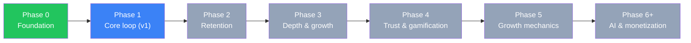
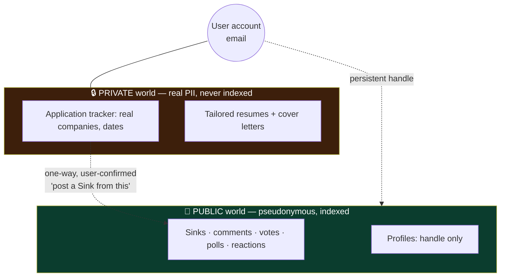

# SinkedIn — Roadmap (phase-by-phase)

This folder is the **working plan**: one detailed file per phase, plus the shared invariants and cross-phase tracks below. It supersedes the single-file `2_SinkedIn_Phased_Roadmap.md` (kept as the terse original) and folds in the retention bets from `3_Retention_Features.md`.

Each phase file also carries a **🔧 Build notes — services & decisions** brief: a per-service build log (*what · the decision · why*) so future-you can retrace exactly how each part was made, step by step.

**Read order:** this README (the rules that constrain everything) → the phase file you're working in. **Never build ahead of the current phase; never skip an exit gate.**

## The phases

| # | File | One line | Status |
|---|---|---|---|
| 0 | [phase-0-foundation.md](phase-0-foundation.md) | Deployed empty skeleton — plumbing proven | ✅ done |
| 1 | [phase-1-core-loop.md](phase-1-core-loop.md) | Post / feed / vote / comment / poll / react — v1 | 🔵 ~90% |
| 2 | [phase-2-retention.md](phase-2-retention.md) | Private tracker + personal insights, companion capture extension, Comeback, digest, "not alone", notifications | ⬜ gated |
| 3 | [phase-3-depth-and-growth.md](phase-3-depth-and-growth.md) | Discovery, follow, **interview-experience SEO hub**, extension **community overlay**, opt-in aggregate insights | ⬜ gated |
| 4 | [phase-4-trust-and-gamification.md](phase-4-trust-and-gamification.md) | Verified Sinks, Auras, ranks, resilience streak | ⬜ gated |
| 5 | [phase-5-growth-mechanics.md](phase-5-growth-mechanics.md) | Shareable cards, Hall of Fame, market weather | ⬜ gated |
| 6+ | [phase-6-ai-and-monetization.md](phase-6-ai-and-monetization.md) | AI roast/translate/auto-fill; honest-employer revenue | ⬜ gated |

---

## The invariants (these constrain every phase)

### 1. Positioning — "narrow soul, wide door"
Audience = **anyone in a tech/corporate career**, not job-seekers only. Job-seekers are the emotional core; employed professionals stop the churn when someone lands a job. **Widen content coverage, keep the voice raw, confessional, darkly funny.** Guardrail: *"would this feel at home on LinkedIn? If yes, it's off-brand."* The anti-LinkedIn direction is an **internal compass, not public branding** (the name already carries the joke; publicly branding "anti-LinkedIn" invites trademark trouble — keep it out of public copy).

### 2. Stack — TypeScript, end to end
- **Frontend:** **Next.js (App Router) + React + TypeScript + Tailwind.** Public reads = server components (SSR for SEO); interactivity = client components; mutations attach the Supabase JWT.
- **Backend:** Node + Express + **TypeScript**, Prisma, PostgreSQL, Zod, Supabase Auth. Strict layering `routes → controllers → services → prisma` (Prisma only in services).
- **Storage/Auth/DB:** Supabase (Postgres + Auth + Storage). Data API off; backend is the sole authorizer.
- **No second language/runtime is introduced anywhere.** (The old Ghost-Index "FastAPI" idea is rejected — if built, it's a TypeScript/Node service.)
- **Hosting:** Vercel (frontend, Mumbai), Render (backend, Singapore), Supabase (Mumbai); keep-warm cron kills free-tier cold starts.

### 3. The pseudonymity wall (hardest boundary — matters from Phase 2)

Public API responses **never** include `email` / `supabaseUserId` / any real-identity field (enforced by Prisma `select`, never stripped after). The private tracker is a separate model; the only link is a **one-way, user-confirmed** bridge.

### 4. Company is free text — Ghost Index is a deferred, optional fork
`company` = optional free text on a Sink, not a canonical entity → aggregate company analytics (the *Ghost Index*) aren't cleanly buildable by design. Moat = **community + content**, not proprietary data. The Ghost Index is a **Phase-3 optional fork** (add a `Company` table + `companyId`, backfill by string-match), built in **TypeScript** if ever chosen. A soft text-match "you're not alone" counter (Phase 2) gives most of the emotional value without it. Real per-company **scorecards** additionally require an **opt-in, k-anonymity-gated `Signal` pipeline** (separate from the private tracker) and legal review — India **DPDP** / defamation. See [Phase 3](phase-3-depth-and-growth.md).

### 5. Never gamify failure
Auras, streaks, ranks reward **helping others** and **persistence** — never collecting rejections. No "most rejected" leaderboard. Hard rule (wellbeing + integrity).

### 6. Data hygiene now → cheap features later
Soft-delete (`deletedAt`) everywhere; enums for fixed sets (`Conclusion`, `VoteValue`); categories are data (config flags), not code; keep Interview-Experience input lightly structured from Phase 1 so the Phase-3 SEO hub has clean input.

### 7. Voting model (locked)
Buoys (up) + Anchors (down); `score` = buoys − anchors, cached. A single user's contribution is **clamped to [-1, +1]**, one step per click, **enforced server-side** (client sends only a direction). Reactions are **separate from `score`**.

### 8. Explicit non-goals
- **No private DMs / user-to-user messaging** — a harassment magnet for a pseudonymous community; the return is better served by notifications + comments + reactions.
- **No jobs board, networking graph, or polished comp calculator** — that's LinkedIn/Grapevine. *(The private application **tracker** and the **capture extension** are a personal, owner-only utility — **not** a jobs board and **not** a bulk scraper: they capture the page the user is on, for that user, into their private tracker.)*
- **No fragile automation on the critical path** — application **autofill** and **AI outcome-detection** are optional, deferred, opt-in, confirmation-gated (Phase 6); LinkedIn/Workday extension support is the fragile, opt-in tier, always structured-data-first.
- **No AI or monetization before the product is proven** (Phase 6+).

---

## Cross-phase engineering tracks (thread through everything)

| Track | Ph1 | Ph2 | Ph3 | Ph4+ |
|---|---|---|---|---|
| **Moderation & safety** | report/hide + manual review + rate limits + handle blocklist | + abuse-aware notifications | + moderation console (queue, warn/suspend, spam heuristics) | + anti-gaming for Auras/verification |
| **Analytics & observability** | error tracking + logs + keep-warm | **retention/funnel analytics** (required to pass the gate) | ranking metrics | AI cost/usage |
| **Notifications & email** | — | in-app + weekly digest (Resend) | full prefs + **opt-in batched per-type email** + follow alerts | — |
| **Job tracker & extension** | — | private tracker + personal insights + **capture** extension (MV3, JSON-LD-first) | **community overlay** + opt-in aggregate `Signal` pipeline (k-anon) | verification-weighted scorecards; AI outcome-detect / autofill *(optional)* |
| **Storage & PII** | — | private resumes/cover letters + export/delete | — | verification PII stripping |
| **Search** | — | — | Postgres full-text search | — |
| **Perf/a11y/security** | Zod at every boundary, RLS on / Data API off, cached public feed, WCAG-minded, CI hygiene | → continuous → | | |

**Never ship a new social surface without its moderation story** (this is *why* DMs are a non-goal).

---

## The two rules
1. **Never skip a gate.** The Phase-1 "does the loop feel good?" gate matters most — honor it even if it means stopping.
2. **Never build ahead of the current phase.** Build what the phase needs, ship it, prove it, move on.

## The trademark thread (parallel to all phases)
Resolve the IP-lawyer conversation before serious commercial weight (before Phase 6, ideally sooner). Keep "anti-LinkedIn" internal only.
