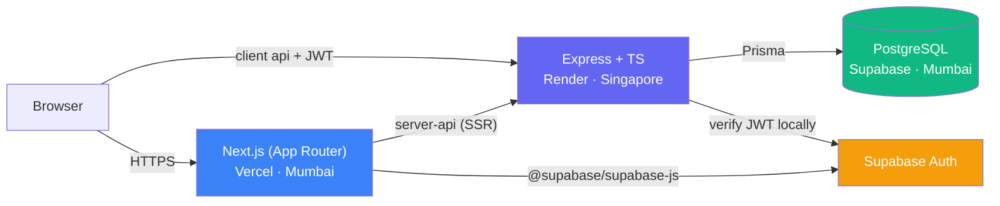
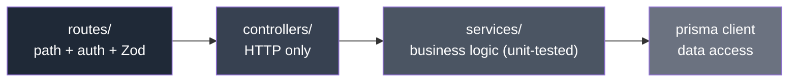

# Phase 0 — Foundation ✅ (done + deployed)

← [Roadmap index](README.md) · Next: [Phase 1 — Core loop](phase-1-core-loop.md)

> **Goal:** a deployed, empty-but-working skeleton. No features — just proof that every layer (frontend ↔ backend ↔ database ↔ auth ↔ deploy) is wired correctly and talks to each other. "Hello world through the entire stack."
>
> **Why a phase of its own:** if a later feature breaks, you want to know it's a *feature* bug, not a *plumbing* bug. Proving the plumbing with zero features eliminates a whole class of confusion. Deploying early surfaces the hidden problems (env vars, CORS, build config, connection strings) while the app is trivial.

## Status
**Complete and live.** Frontend on Vercel, backend on Render, DB + Auth on Supabase; CI runs on push.

## The stack, proven end to end

## The layering that every request follows (established here)

**Rule:** Prisma calls live only in services; controllers hold no business logic. Set from the first real endpoint so the pattern is inherited by everything after.

## What was built (checklist)
- **0.1 Repo & tooling** — git, `.gitignore`, layered folders, ESLint/Prettier, `.env.example`, `CLAUDE.md` at root.
- **0.2 Database + schema** — local Docker Postgres, Prisma schema (User, Sink, Category, Vote, Comment, PollOption, PollVote + enums) migrated; Prisma Client generated (typed DB access = anti-hallucination ground truth).
- **0.3 Backend skeleton** — Express boots, `/health` reaches the DB, layered structure in place.
- **0.4 Auth wired** — Supabase Auth on both sides; signup/login; a `User` row with a persistent pseudonymous `handle` on signup; a protected endpoint proves auth gates access. *(Backend now verifies the Supabase JWT **locally** — HS256 legacy secret or asymmetric JWKS — instead of a per-request network call.)*
- **0.5 Frontend skeleton** — Next.js App Router boots, can sign in, calls the backend, basic routing.
- **0.6 Deploy** — all three providers live and talking; env vars per environment; minimal CI (tests + build on push). Multi-origin CORS; keep-warm cron for Render's free tier.

## What the user can do
Almost nothing — sign up, log in, get an anonymous handle, see an empty shell. **This is correct.** Phase 0 is a promise to *you* (the plumbing works), not to the user.

## Exit gate (met)
A live URL round-trips frontend → backend → database → back; schema migrated in all environments; `CLAUDE.md`, git hygiene, and env-var handling in place. Nothing user-facing works yet — and that's the right outcome.
