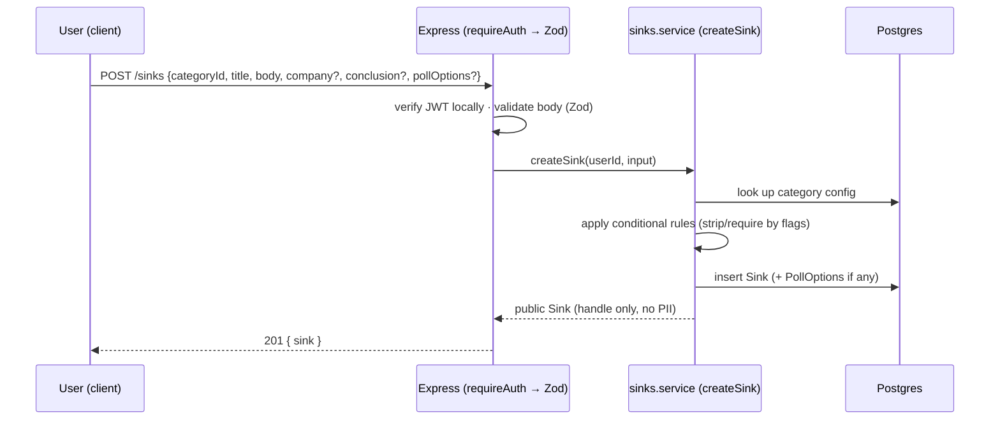
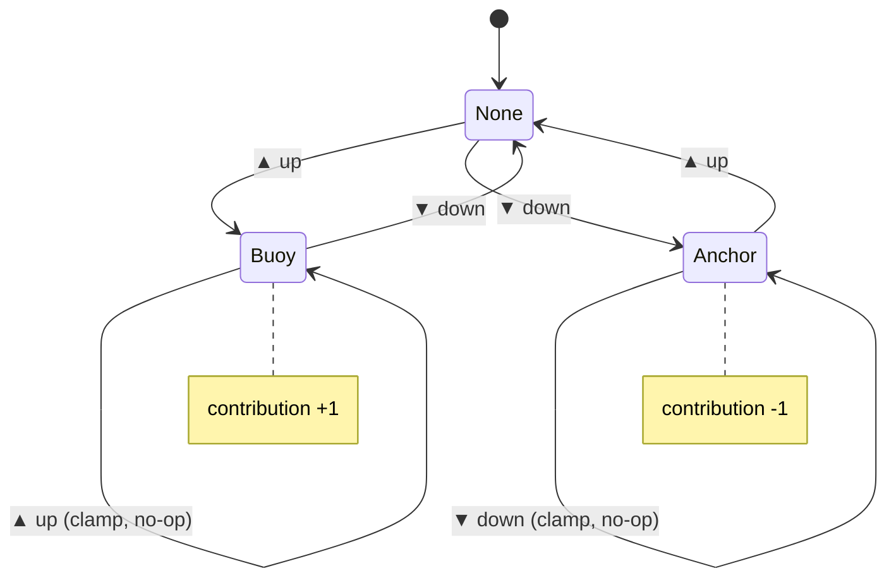

# Phase 1 — The core loop (v1) 🟢 code-complete (pending seeding + the feel gate)

← [Phase 0](phase-0-foundation.md) · [Index](README.md) · Next: [Phase 2 — Retention](phase-2-retention.md)

> **Goal:** the minimum that makes **posting a Sink feel good and reading the feed feel engaging.** This is the entire product hypothesis. Nothing downstream has value until it's proven.
>
> **Entry gate:** Phase 0 exit gate met.
>
> **The split:** *1a* = the posting loop (riskiest — will anyone post?), ship + test alone first. *1b* = the discussion + solidarity layer (comments, polls, reactions), added once 1a is proven.

## What the user can newly do
Post a Sink (category + text + conditional fields + optional image) in under a minute, anonymously · scroll / filter the feed · buoy or anchor · comment and reply (threaded), **vote on comments**, and do it all **inline in the feed** (no page navigation) · vote in polls · one-tap react · **pick a handle at signup** (onboarding) and change handle/avatar in Settings · **report** a Sink or comment · view any pseudonymous profile and its post history.

> **Status note (this build):** the core loop, comment-voting, inline feed comments, avatars, the handle picker + first-run onboarding, minimal moderation (report + rate-limit), and image upload are all **built and passing tests (89 backend tests, tsc + lint clean)**. What remains for the exit gate is **non-code**: seed real content (and clear dev test junk), then judge whether the loop *feels good*. The **"top" sort** is intentionally deferred (the "For you / Trending / Latest" tabs are placeholders for later phases).

> **Felt experience:** "It's a Reddit for the real side of work — I ranted about a rejection *and* my manager, got 40 buoys and a dozen 'been there' replies, voted on a '12 LPA?' poll, and read three interview experiences for a company I'm interviewing at."

---

## Data model at Phase 1

```mermaid
erDiagram
    User ||--o{ Sink : posts
    User ||--o{ Vote : casts
    User ||--o{ Comment : writes
    User ||--o{ PollVote : casts
    User ||--o{ Reaction : taps
    User ||--o{ Report : files
    Category ||--o{ Sink : classifies
    Sink ||--o{ Vote : has
    Sink ||--o{ Comment : has
    Sink ||--o{ PollOption : has
    Sink ||--o{ Reaction : has
    PollOption ||--o{ PollVote : has
    Comment ||--o{ Comment : "parentId (threaded)"

    User { string id PK; string handle UK; string supabaseUserId UK; datetime createdAt }
    Category { string id PK; string name UK; string slug UK; string color; string description; bool showsCompany; bool showsConclusion; bool allowsPoll; bool requiresPoll }
    Sink { string id PK; string title; string body; string company "free text"; enum conclusion; int score "cached"; datetime deletedAt; string categoryId FK; string userId FK }
    Vote { string id PK; enum value "BUOY|ANCHOR"; string sinkId FK; string userId FK }
    Comment { string id PK; string body; string parentId FK; datetime deletedAt; string sinkId FK; string userId FK }
    PollOption { string id PK; string label; int position; string sinkId FK }
    PollVote { string id PK; string pollOptionId FK; string userId FK }
    Reaction { string id PK; string kind; string sinkId FK; string userId FK }
    Report { string id PK; string targetType; string targetId; string reason; string status }
```
- `Vote` has `@@unique([sinkId, userId])`; `PollVote` enforces **one vote per poll** (not per option) in the service.
- **Privacy:** every public query `select`s only safe fields — `email`/`supabaseUserId` never leave the backend.
- **New this phase:** `Reaction` + per-category reaction config (1b); `Report` (moderation).

---

## 1a — the posting loop

### Post a Sink `[built]`
Category-first composer: choose a category → the form reveals only that category's conditional fields (company, conclusion, poll options) driven by the category's config flags → Zod-validated at the route, **category-conditional rules enforced in the service** (e.g. `requiresPoll`, `conclusion === OTHER` needs free text, unused fields stripped). Manual, no AI, <60s.



### Categories `[built]` — the "wide door" in data
Seeded, extensible `Category` table spanning **both worlds**:
- **Job-hunt:** Interview Experience, Rejection, Ghosted, Offer, Salary, Layoff, Comeback
- **Working-life:** Bad Boss, Burnout, Win, Corporate Cringe
- **General:** Poll, Advice, Discussion, Rant, Meme, Resource

Adding a category (or changing which fields it reveals) is a **data** change — no deploy. This is how "add more categories later" stays free.

### The feed `[built]`
Server-rendered (Next.js server components) for SEO; **infinite-scroll pagination** (10/page, **cursor-based** on `createdAt` — stable when new Sinks arrive mid-scroll); category filter; `SinkCard`s with category pills. Client fetches later pages with the JWT so vote highlights come pre-attached.

### Buoys & Anchors `[built]` — the clamped stepper
`score` = buoys − anchors, cached on the Sink. A user's contribution is **clamped to [-1, +1]** and moves **one step per click**. The clamp is **server-side** — the client sends only a direction, so stale client state can never swing a score by 2.



### Profile (basic) `[built]`
`/u/:handle` — handle, join date, post history; SSR + per-profile share metadata. Handles link to profiles across the feed and from the header (your own).

### Handle system `[built]`
Persistent pseudonymous `handle`, funny + sea-themed (`Drowning_Guppy_402`), auto-assigned on signup. **Picker built:** 3-4 suggestions or type-your-own with a **live availability check** and **blocklist** (reserved/role words, admin/official/staff, basic profanity), plus a **first-run onboarding modal** ("pick a handle, or keep this one"). Available in Settings and as the signup onboarding step (`User.handleChosen` gates it).

### Moderation (basic) `[built]`
Report a Sink or comment (`Report` model, one per user per target, idempotent) via a quiet exclamation icon; **write rate-limiting** on create-sink / comment / report; the handle blocklist. Hiding is a manual soft-delete (`deletedAt`) for now; the review console is [Phase 3](phase-3-depth-and-growth.md).

### Sort `[partial]`
Feed is "new" (createdAt desc). **Pending:** "top" (by cached `score`) — needs a `score`-keyed cursor (or capped offset) so it composes with pagination.

---

## 1b — discussion + solidarity

### Comments `[built]`
Threaded (top-level + replies via `parentId`), **optimistic append** — the posted comment appears from the server's response with no full-page refresh/flash.

### Polls `[built]`
2–6 options; **one vote per poll** (not per option, enforced in the service); live result bars; optimistic (highlight instant, counts from server).

### Category reactions / solidarity taps `[built — 2026-08-26, filled the Phase-1 gap during Phase 2]`
One-tap, category-specific reactions beyond voting — Rant → "Been there" / "IKR"; Ghosted → "Classic" / "Same"; Rejection → "F" / "Their loss"; Comeback → "Let's go". A low-friction emotional layer.

**Design locks:**
- **Separate from `score`** — reactions are solidarity, not ranking; visually and functionally distinct from buoy/anchor.
- **Config-driven per category** — the reaction set is data on `Category` (like `showsCompany`); adding reactions to a category is a *data* change. Needs the `Reaction` table + a per-category reaction config.
- One reaction per user per Sink; counts (not lists) on the card to stay cheap.
- Feeds the Phase-2 "you're not alone" counter later.

**Gate:** build only after post/vote/comment are live and users prove they engage. A one-tap reaction is lower friction than a comment → far more people participate.

---

## Also built this phase (beyond the original v1 sketch) `[built]`
- **Comment voting** — Buoy/Anchor on comments (mirrors Sink voting, server-clamped), `CommentVote` model + cached `Comment.score`; the feed previews the top comment.
- **Inline feed comments** — read/reply/vote/add without leaving the feed: `SinkComments` lazy-loads the full thread inline, `AddFirstComment` for empty Sinks, reply is one-at-a-time + click-outside-to-close, "See more" truncates long bodies (`/s/:id` still the SEO permalink).
- **Avatars** — data-driven `avatarId` (ocean-creature set on a grey badge), deterministic default by handle-hash, picker in Settings. Art is a **placeholder** (hand-coded SVGs, to be swapped for designed assets later; data-driven so only `avatarArt.tsx` changes).
- **Image upload on Sinks** — optional `Sink.imageUrl`; all storage logic isolated in one `uploadSinkImage` function (Supabase Storage now, swappable later). Needs a public `sink-media` bucket + an authenticated-INSERT storage policy.
- **Plumbing** — shared `useMe` provider (one `/users/me` fetch app-wide), root `error.tsx` boundary, and a YouTube-style top loading bar.

## The critical non-code activity — seeding
Seed **30–50 real, relatable Sinks** across a few categories (yours, friends' with permission, curated-public with attribution) **before** showing anyone. An empty feed feels dead; a seeded one feels alive — **load-bearing for the whole test.** Demo/synthetic data stays clearly marked + removable and never masquerades as real on the indexed product.

## 🔧 Build notes — services & decisions (brief)
*A build log for future-you: per service, what we built, the key decision, and why.*
- **Category-first composer** — config flags on `Category` decide which fields appear. **Decision:** Zod at the route, **category-conditional rules in the service** (require/strip by flag). **Why:** categories are data, not code — adding one is a data change, no deploy.
- **Clamped vote stepper** (`stepVote`) — client sends only a **direction**; the server clamps to `[-1, +1]`, one step per click. **Decision:** enforce the invariant **server-side.** **Why:** stale client state can never swing a score by 2 — the server owns the truth.
- **Feed** — SSR server components + **cursor pagination** on `createdAt`. **Decision:** cursor (not offset) + server-render. **Why:** stable when new Sinks arrive mid-scroll; SEO-indexable HTML + share previews.
- **Comments & polls** — threaded via `parentId`; **optimistic append** from the server's response. **Decision:** one round-trip, no full-page re-pull. **Why:** snappy, no flash; poll enforces one-vote-per-poll in the service.
- **Reactions** — `Reaction` table + per-category config, **separate from `score`**, counts not lists. **Decision:** config-driven, one per user per Sink. **Why:** cheap, ranking stays legible, adding reactions is a data change.
- **Identity (handles + avatars)** — auto-assigned `Adjective_Noun_Number` handle; data-driven `avatarId` with a **deterministic default by handle-hash** and a swappable id→art catalog. **Decision:** art is a placeholder to replace later; the id list/defaults/picker stay. **Why:** identity delight without coupling to app code. *(Handle **picker** — suggestions/uniqueness/blocklist — still pending.)*

## Tradeoffs & decisions
- **Reactions vs. clutter:** keep them counts, not lists; distinct from votes so the ranking signal stays legible.
- **Moderation depth:** manual review is fine now — but ship report/hide + rate limits as cheap day-one insurance (a public post-anything community *will* attract abuse).
- **"Top" sort × pagination:** cursor must switch key (createdAt → score) per sort; decide at build.
- **Interview-Experience data hygiene:** encourage a lightly-structured body (rounds/questions/outcome) now so the Phase-3 SEO hub has clean input — **do not build the hub here.**

## Safety this phase
Report/hide + manual review; handle blocklist; write rate-limits; zero PII in any public response.

## Exit gate — the most important in the project
The loop works end-to-end, deployed, **and the qualitative test passes**: you + a handful of real early users genuinely find posting satisfying and reading/voting/commenting/reacting engaging — not "it functions" but *"it feels good."*

**If it doesn't feel good, stop and fix the loop. Do not proceed to Phase 2.** No later feature rescues a dead core loop. This is the honest gate that saves you from building a beautiful dead product.
