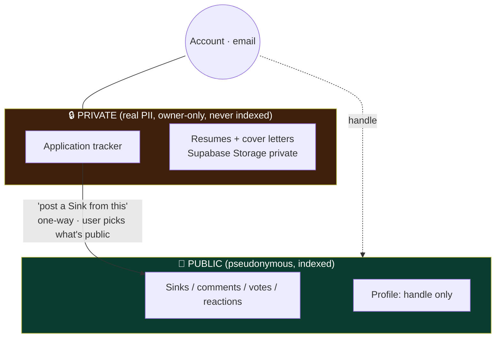
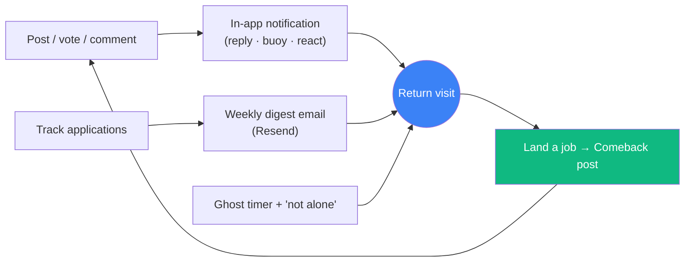

# Phase 2 — Retention & identity spine ⬜ (gated)

← [Phase 1](phase-1-core-loop.md) · [Index](README.md) · Next: [Phase 3 — Depth & growth](phase-3-depth-and-growth.md)

> **Goal:** give people reasons to come *back* — convert one-time visitors into returning users. This is where MAU (a retention number) becomes real. The job hunt's months-long span is the natural retention window.
>
> **Entry gate:** Phase 1 loop **proven satisfying** (the qualitative gate passed with real users).

## What the user can newly do
Track their own hunt privately — logging every application **with the exact resume they used** — and watch their funnel / response rate / ghost rate · post a **Comeback** when they land a job · get a weekly **digest** email · feel **"not alone"** and watch a ghost timer · get **notified** when people engage · export or delete their data.

> **Felt experience:** "I'm actually managing my search here — logging every application, watching my response rate — and when I finally got the offer, posting the Comeback was the most satisfying thing I've done online all year."

---

## ⚠️ This phase introduces real PII — the pseudonymity wall goes load-bearing

Until now everything was pseudonymous. The tracker stores **real company names, real dates, and tailored resumes/cover letters**. These two worlds must never leak.


- Tracker is a **separate model**, not derived from Sinks.
- The **only** link is a one-way, user-confirmed bridge — real company/resume data never auto-flows public.
- Storage is **private-by-default**, owner-only via the backend, encrypted at rest.
- Ship **data export + account/data delete** *with* this feature (soft-delete public content, hard-remove private PII). Not later.

---

## Data model additions

```mermaid
erDiagram
    User ||--o{ Application : owns
    User ||--o{ Notification : receives
    User ||--|| EmailPrefs : has
    Application ||--o| ResumeFile : "attaches (Storage)"
    Application ||--o| Sink : "one-way bridge (optional)"

    Application { string id PK; string userId FK; string company "free text"; string role; enum status "APPLIED|RESPONDED|INTERVIEW|OUTCOME"; datetime appliedAt; datetime respondedAt; string outcome; string resumeFileKey; string coverLetterFileKey; datetime deletedAt }
    Notification { string id PK; string userId FK; enum type "REPLY|BUOY|REACTION|POLL_RESULT"; string actorHandle; string sinkId; datetime readAt; datetime createdAt }
    EmailPrefs { string userId PK; bool weeklyDigest; datetime unsubscribedAt }
```
Plus a private Supabase Storage bucket for `ResumeFile`/cover-letter blobs, and an analytics event store (separate table or provider).

---

## The retention loop (how the pieces drive return)



---

## Build

### Application tracker (private, standalone) `[in-plan]`
A private log of every application: company (free text), role, dates, a status funnel (applied → response → interview → outcome). Surfaces **response rate / ghost rate across *all* applications**, not just the memorable ones you posted — the JobMaxxing-overlap piece, and its own mini-spec at build time.

### Resume / cover-letter storage `[new · required]`
Attach the tailored resume (+ cover letter) used for each application → **Supabase Storage, private-by-default**. This is what turns SinkedIn from a vent-wall into a *useful tool* — and what makes the pseudonymity wall load-bearing.

### One-way bridge to Sinks `[in-plan]`
"Post a Sink from this application" pre-fills a compose from tracked data; the user explicitly chooses what becomes public. Independent models — real data never auto-flows.

### The Comeback flow `[in-plan · retention #4 (flow)]`
Close out your Sinks with a "Comeback" post when you land a job ("40 rejections, 1 offer, here's what worked"). Flips landing-a-job from a **churn event** into a **return event** and produces your most shareable content (the *card* ships in [Phase 5](phase-5-growth-mechanics.md)).

### Weekly digest email `[new · retention #2]`
"Your week in the trenches" — e.g. "4 applications, 1 ghost, 25% response rate, 3 replies to your Sinks", from tracker + activity. Email/notification loops are *the* mechanical return driver — the single cheapest retention win. **On-brand tone (funny, not corporate-HR).** Provider: **Resend** (free tier, TypeScript SDK). Unsubscribe-first; respect `EmailPrefs`.

### "You're not alone" counter + Ghost timer `[new · retention #3]`
- **Counter:** on a rejection/ghost from Company X, "23 others were rejected by X this month" via **soft text-match on free-text `company`** (no `Company` table — consistent with the deferred Ghost Index). Presented as **vibes, not precise stats.**
- **Ghost timer:** a live "ghosted for 34 days" counter on ghosted posts / tracked applications — manufactures gentle return visits, darkly funny, on-brand.

### In-app notifications (basic) `[new · required]`
Someone replied / buoyed / reacted / your poll resolved → a `Notification` model + header bell + read/unread. The minimum return-driver that pairs with the email digest. (Full personalization/following is [Phase 3](phase-3-depth-and-growth.md).)

### Richer profiles `[in-plan]`
Sink history, join date, (later) badges; a handle that now accrues a history worth returning to.

### Account & data controls `[new · table-stakes once PII exists]`
Settings: change email, **export my data**, **delete account** (soft-delete public content, hard-remove private PII/resumes).

### Analytics / instrumentation `[new · required for the exit gate]`
You cannot pass "people come back across weeks" without measuring it: lightweight, privacy-respecting event tracking (returns, cohort retention, funnel). On-brand "no creepy tracking."

---

## Tradeoffs & decisions
- **PII gravity:** resumes make you a higher-value breach target and pull in data obligations (retention, deletion, region). Private bucket, owner-only access via backend, encryption at rest, and delete/export shipped *with* the feature.
- **Email deliverability & fatigue:** start weekly, unsubscribe-first, warm the domain — a spammy digest churns faster than none.
- **Notification scope creep:** ship a *small* set (reply/buoy/react/poll) well before follows; over-notifying is as bad as under-notifying.
- **Counter honesty:** free-text match is fuzzy ("Amazon"/"amazon"/"Amazon India") — solidarity vibes, never a statistic (keeps you consistent with the deferred Ghost Index and honest by brand).

## Safety this phase
Private-by-default storage + owner-only access; data export/delete; unsubscribe; abuse-aware notifications (no notification-spam vector); still report/hide + rate limits.

## Exit gate
**Measurable return behaviour** — people come back across multiple sessions/weeks, not just once (now visible via the analytics you added). Only then proceed to Phase 3.
