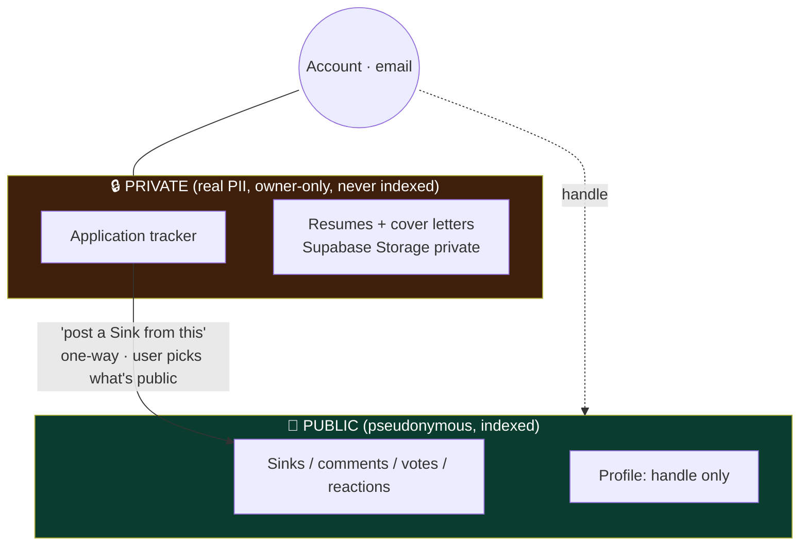
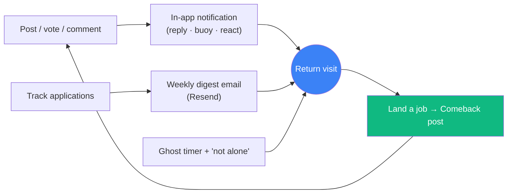
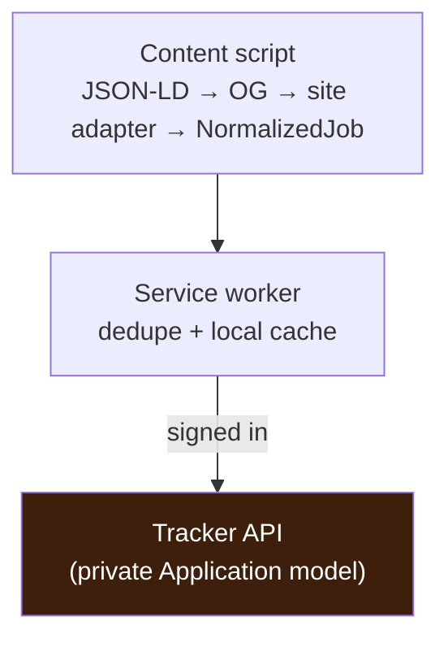

# Phase 2 — Retention & identity spine ⬜ (gated)

← [Phase 1](phase-1-core-loop.md) · [Index](README.md) · Next: [Phase 3 — Depth & growth](phase-3-depth-and-growth.md)

> **Goal:** give people reasons to come *back* — convert one-time visitors into returning users. This is where MAU (a retention number) becomes real. The job hunt's months-long span is the natural retention window.
>
> **Entry gate:** Phase 1 loop **proven satisfying** (the qualitative gate passed with real users).

## What the user can newly do
Track their own hunt privately — logging every application **with the exact resume they used** — and watch their funnel / response rate / ghost rate · see **personal insights** (which resume gets replies, which source responds fastest, an "already applied here" warning) · optionally **save jobs straight from the browser** with a companion extension · post a **Comeback** when they land a job · get a weekly **digest** email · feel **"not alone"** and watch a ghost timer · get **notified** when people engage · export or delete their data.

> **Felt experience:** "I'm actually managing my search here — logging every application, watching my response rate — and when I finally got the offer, posting the Comeback was the most satisfying thing I've done online all year."

---

## ⚠️ This phase introduces real PII — the pseudonymity wall goes load-bearing

Until now everything was pseudonymous. The tracker stores **real company names, real dates, and tailored resumes/cover letters**. These two worlds must never leak.


- Tracker is a **separate model**, not derived from Sinks.
- The **only** link is a one-way, user-confirmed bridge — real company/resume data never auto-flows public.
- Storage is **private-by-default**, owner-only via the backend, encrypted at rest.
- Ship **data export + account/data delete** *with* this feature (soft-delete public content, hard-remove private PII). Not later.

---

## Data model additions

```mermaid
erDiagram
    User ||--o{ Application : owns
    User ||--o{ Notification : receives
    User ||--|| EmailPrefs : has
    Application ||--o| ResumeFile : "attaches (Storage)"
    Application ||--o| Sink : "one-way bridge (optional)"

    Application { string id PK; string userId FK; string company "free text"; string role; enum status "APPLIED|RESPONDED|INTERVIEW|OUTCOME"; datetime appliedAt; datetime respondedAt; string outcome; string resumeFileKey; string coverLetterFileKey; string source "manual|greenhouse|lever|indeed|linkedin|…"; string sourceUrl; string sourceJobId; string dedupeKey "norm(company+title+location)"; datetime deletedAt }
    Notification { string id PK; string userId FK; enum type "REPLY|BUOY|REACTION|POLL_RESULT"; string actorHandle; string sinkId; datetime readAt; datetime createdAt }
    EmailPrefs { string userId PK; bool weeklyDigest; datetime unsubscribedAt }
```
Plus a private Supabase Storage bucket for `ResumeFile`/cover-letter blobs, and an analytics event store (separate table or provider). The `source` / `sourceUrl` / `sourceJobId` / `dedupeKey` fields are populated by **manual entry _or_ the companion extension** — the extension is just another writer into the *same* private model, never a second store.

> **Notifications recap:** the `Notification` model above powers in-app alerts on **replies, buoys, reactions, and resolved polls** — the mechanical return-driver detailed under *In-app notifications* below. Full personalization (follow-based alerts, per-type prefs, thread digests) is [Phase 3](phase-3-depth-and-growth.md).

---

## The retention loop (how the pieces drive return)



---

## Build

### Application tracker (private, standalone) `[in-plan]`
A private log of every application: company (free text), role, dates, a status funnel (applied → response → interview → outcome). Surfaces **response rate / ghost rate across *all* applications**, not just the memorable ones you posted — the JobMaxxing-overlap piece, and its own mini-spec at build time.

### Resume / cover-letter storage `[new · required]`
Attach the tailored resume (+ cover letter) used for each application → **Supabase Storage, private-by-default**. This is what turns SinkedIn from a vent-wall into a *useful tool* — and what makes the pseudonymity wall load-bearing.

### One-way bridge to Sinks `[in-plan]`
"Post a Sink from this application" pre-fills a compose from tracked data; the user explicitly chooses what becomes public. Independent models — real data never auto-flows.

### The Comeback flow `[in-plan · retention #4 (flow)]`
Close out your Sinks with a "Comeback" post when you land a job ("40 rejections, 1 offer, here's what worked"). Flips landing-a-job from a **churn event** into a **return event** and produces your most shareable content (the *card* ships in [Phase 5](phase-5-growth-mechanics.md)).

### Weekly digest email `[new · retention #2]`
"Your week in the trenches" — e.g. "4 applications, 1 ghost, 25% response rate, 3 replies to your Sinks", from tracker + activity. Email/notification loops are *the* mechanical return driver — the single cheapest retention win. **On-brand tone (funny, not corporate-HR).** Provider: **Resend** (free tier, TypeScript SDK). Unsubscribe-first; respect `EmailPrefs`.

### "You're not alone" counter + Ghost timer `[new · retention #3]`
- **Counter:** on a rejection/ghost from Company X, "23 others were rejected by X this month" via **soft text-match on free-text `company`** (no `Company` table — consistent with the deferred Ghost Index). Presented as **vibes, not precise stats.**
- **Ghost timer:** a live "ghosted for 34 days" counter on ghosted posts / tracked applications — manufactures gentle return visits, darkly funny, on-brand.

### In-app notifications (basic) `[new · required]`
Someone replied / buoyed / reacted / your poll resolved → a `Notification` model + header bell + read/unread. The minimum return-driver that pairs with the email digest. (Full personalization/following is [Phase 3](phase-3-depth-and-growth.md).)

### Richer profiles `[in-plan]`
Sink history, join date, (later) badges; a handle that now accrues a history worth returning to.

### Account & data controls `[new · table-stakes once PII exists]`
Settings: change email, **export my data**, **delete account** (soft-delete public content, hard-remove private PII/resumes).

### Analytics / instrumentation `[new · required for the exit gate]`
You cannot pass "people come back across weeks" without measuring it: lightweight, privacy-respecting event tracking (returns, cohort retention, funnel). On-brand "no creepy tracking."

### Personal insights — analytics on your OWN data `[new]`
The tracker isn't just a list, it's a **private dashboard**. Every insight here is derived from the user's *own* rows — **no aggregation, no cross-user data, so zero privacy/legal risk.** This is the safe 80% of the value; ship it before any community aggregate.
- **Funnel + rates:** response rate, ghost rate, interview rate across *all* applications — not just the memorable ones the user posted about.
- **Which resume wins:** reply rate per `resumeFileKey` — e.g. "Resume B gets 2× the replies." (This is *why* resume-per-application storage matters.)
- **Which source responds:** reply rate/time per `source` — e.g. "Greenhouse replies in 6 days; LinkedIn rarely replies." (Needs auto source-tagging, below.)
- **Cadence nudges:** "4 applied this week, 0 last" — a gentle, non-shaming prompt (never a "you're behind others" scoreboard).

### Cross-board "already applied" dedupe `[new]`
The same job shows up on LinkedIn + Indeed + the company's own Greenhouse. Normalize `company + title + location` (plus the ATS `sourceJobId` when present) into a `dedupeKey`, and warn **"you already applied here 3 weeks ago."** Genuinely useful on its own, and the foundation for later aggregate de-duplication.

### Auto source-tagging `[new]`
Tag every application by where it came from (board/ATS). It's the user's own metadata → **zero aggregation risk**, and it unlocks the "which source responds" insight above. Populated automatically by the extension, or a dropdown on manual entry.

### Application graveyard `[new · on-brand humor]`
A darkly-funny view of dead / ghosted applications — cathartic, a shared shrug at the void. Respects the **"never gamify failure"** rule: it's commiseration, *not* a rejection counter to climb. (See [Phase 4](phase-4-trust-and-gamification.md)'s hard rule.)

### Companion Chrome extension — capture MVP `[new · OPTIONAL companion · gated behind the tracker existing]`
A thin browser client that saves the job on the page you're viewing straight into your tracker. **It's a multiplier on the tracker — pointless before the tracker exists**, so it is explicitly a *companion*, not a prerequisite.
- **Extraction, robust-first:** read `schema.org/JobPosting` **JSON-LD** first (stable, standardized, present on most job pages for Google-Jobs SEO), then OpenGraph/microdata, then per-site CSS adapters only where structured data is missing. One generic extractor covers many sites for free.
- **Adapter registry** (mirrors "categories are data, not code"): each site is one small module implementing `matches(url)` + `extract(doc) → NormalizedJob`. **Adding a site = one file, never a core change** — this is the whole maintainability story.
- **Manifest V3**, `activeTab` + **per-host opt-in** permissions (never `<all_urls>` — better for Web Store review *and* trust), local-first storage, syncs to the tracker when signed in.
- **Writes to the SAME private `Application` model** — no second backend; PII stays owner-only, on-brand "only the page you're on, only when you act."



> **⚠️ Optional / harder tier — defer, and it *will* break:** ATS pages (**Greenhouse / Lever / Ashby**) are easy and stable — start there. **LinkedIn and Workday are fragile and high-maintenance** (aggressive anti-automation; obfuscated, iframe-heavy, per-tenant markup) — support them *last*, current-page-only, opt-in, and accept ongoing breakage. **Auto-filling applications** and **auto-detecting outcomes** are deliberately **not** here — see [Phase 6 optional](phase-6-ai-and-monetization.md). The extension's *community overlay* (its real differentiator) is [Phase 3](phase-3-depth-and-growth.md).

---

## 🔧 Build notes — services & decisions (brief)
*A build log for future-you: per service, what we build, the key decision, and why.*
- **Application tracker** — a **separate Prisma model**, owner-only through the backend. **Decision:** *not* derived from Sinks; the only public link is a one-way, user-confirmed "post a Sink from this." **Why:** the pseudonymity wall — real PII must never leak into the public world.
- **Resume / cover-letter storage** — **Supabase Storage private bucket**, backend-mediated, signed short-lived URLs. **Decision:** private-by-default, encrypted at rest. **Why:** resumes make you a breach target; minimize exposure.
- **Data export / delete** — shipped *with* the tracker. **Decision:** soft-delete public content, **hard-remove** private PII/resumes. **Why:** table stakes once PII exists (India DPDP / GDPR).
- **Weekly digest** — **Resend** (free tier, TS SDK), unsubscribe-first. **Decision:** weekly digest + in-app bell now; **no per-event email** yet (that's Phase 3, opt-in, batched). **Why:** per-event email fatigue churns faster than silence.
- **In-app notifications** — `Notification` rows on reply/buoy/reaction/poll + a header bell. **Decision:** a *small* fixed set, in-app first. **Why:** over-notifying is as bad as under-notifying; follow-based alerts wait for Phase 3.
- **"Not alone" counter + ghost timer** — fuzzy text-match on free-text `company`. **Decision:** vibes, never a precise stat; **no `Company` table.** **Why:** honesty + consistency with the deferred Ghost Index.
- **Personal insights** — single-user math over the tracker rows. **Decision:** **no cross-user aggregation** in this phase. **Why:** anything cross-user is the Ghost Index (Phase 3), gated.
- **Companion extension** — MV3, structured-data-first adapters, per-host opt-in perms, local-first, **writes the same `Application` model.** **Decision:** JSON-LD → OpenGraph → per-site CSS fallback; one file per site. **Why:** maintainability + ToS-defensibility.
- **Analytics** — privacy-respecting event store (returns, cohorts, funnel). **Decision:** measure retention (needed to pass the gate), "no creepy tracking." **Why:** you can't prove retention without measuring it.

---

## Tradeoffs & decisions
- **PII gravity:** resumes make you a higher-value breach target and pull in data obligations (retention, deletion, region). Private bucket, owner-only access via backend, encryption at rest, and delete/export shipped *with* the feature.
- **Email deliverability & fatigue:** start weekly, unsubscribe-first, warm the domain — a spammy digest churns faster than none.
- **Notification scope creep:** ship a *small* set (reply/buoy/react/poll) well before follows; over-notifying is as bad as under-notifying.
- **Counter honesty:** free-text match is fuzzy ("Amazon"/"amazon"/"Amazon India") — solidarity vibes, never a statistic (keeps you consistent with the deferred Ghost Index and honest by brand).
- **The extension is a companion, not the product:** it captures the page the user is *viewing*, for their *own private* tracker (ToS-defensible) — it must never drift into a jobs board or a bulk scraper. Prefer JSON-LD to brittle CSS selectors so a site redesign doesn't break capture. Maintenance cost is real; keep the supported-site list small and structured-data-first.
- **Personal insights are safe; community aggregates are not (yet):** everything in this phase is single-user math. The moment an insight crosses users it becomes the **Ghost Index** ([Phase 3](phase-3-depth-and-growth.md)) — gated separately behind opt-in, k-anonymity, and legal review. Don't let "insights" quietly become cross-user analytics here.

## Safety this phase
Private-by-default storage + owner-only access; data export/delete; unsubscribe; abuse-aware notifications (no notification-spam vector); still report/hide + rate limits. Extension uses **minimal, per-site opt-in** permissions and is **local-first** — captured data never leaves the private tracker.

## Exit gate
**Measurable return behaviour** — people come back across multiple sessions/weeks, not just once (now visible via the analytics you added). Only then proceed to Phase 3.
