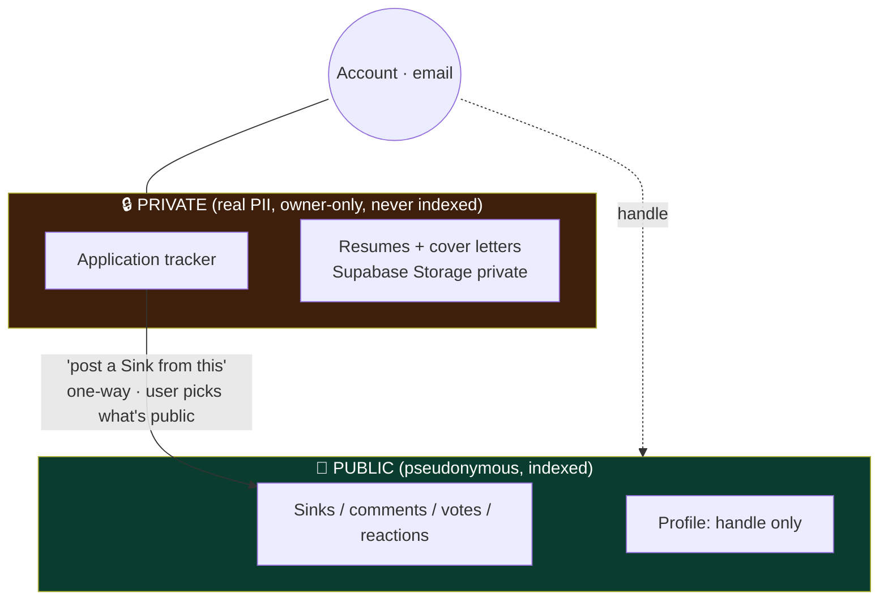
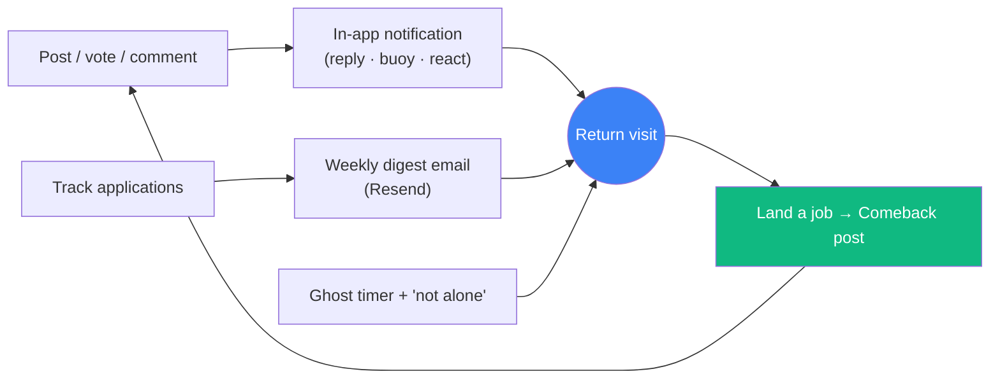
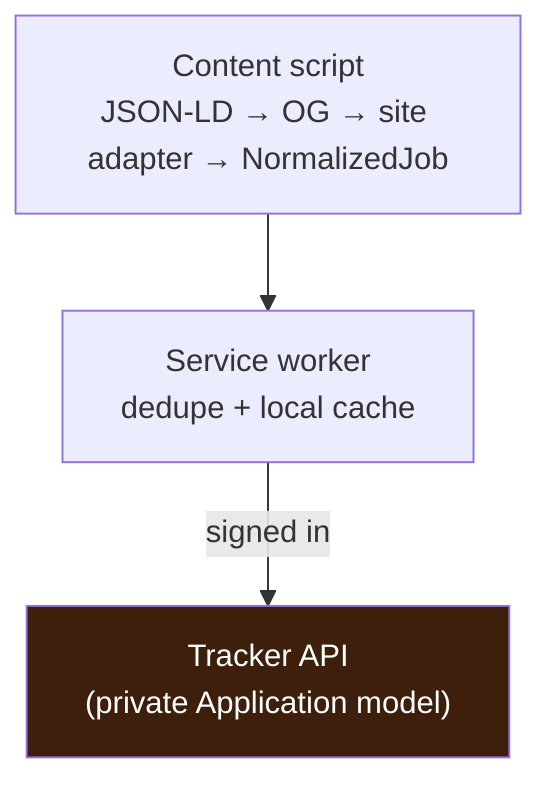

# Phase 2 — Retention & identity spine ⬜ (gated)

← [Phase 1](phase-1-core-loop.md) · [Index](README.md) · Next: [Phase 3 — Depth & growth](phase-3-depth-and-growth.md)

> **Goal:** give people reasons to come *back* — convert one-time visitors into returning users. This is where MAU (a retention number) becomes real. The job hunt's months-long span is the natural retention window.
>
> **Entry gate:** Phase 1 loop **proven satisfying** (the qualitative gate passed with real users).

> **⚠️ Status (2026-08-26):** Phase 2 was **started early**, before the Phase-1 qualitative gate was formally passed (owner's call). The **private job tracker is substantially built** and live: full CRUD + list/board, interview rounds, the centralized `Company` entity + logos, resume-PDF-per-application, and the data export + delete controls. What remains for the phase's exit gate is the **retention half** — personal insights, in-app notifications, weekly digest — plus the analytics to prove weekly return. See the changelog below.

## 🔨 Build progress + changelog
*Updated 2026-08-24 — what is actually built, and what changed vs the original Phase-2 plan above.*

**Built (dev):**
- **Tracker core** — `Application` model (owner-only, `requireAuth` everywhere, soft-deleted, never in a public select). CRUD at `/api/v1/applications`. A **List view** and a **Board (kanban)** with drag-between-columns, add/edit/delete, inline status change. Public SEO **landing at `/tracker`**; the private app at **`/tracker/app`** (noindex). Sidebar "Your Tracker" per-status counts that deep-link to the filtered app.
- **Capture-now data model (from the tracker audit)** — added **`Company`** (centralized, deduped by `normalizedName`; the tracker auto-resolves typed company names into it) + `Application.companyId`, and **`ApplicationEvent`** (status-transition history, logged on create + every status change). These are the two "lossy if not captured from day one" items.
- **Interview rounds** — `InterviewRound` (per-application, add/remove/reorder; compact expandable editor). Different companies have different round counts, so rounds live per-application, not as board columns.
- **Resume PDF per application (2026-08)** — `Application.resumeFileKey` + `resumeFileName`. One file per application (`{supabaseUserId}/{uuid}.pdf`) in a **private** `resumes` bucket (Public OFF, RLS per-user folder). Storage is client-side (`lib/uploadResume.ts`); the backend only holds the key + filename and never touches the bucket. PDF-only, ≤3MB (code + bucket limit); download via short-lived signed URL; upload-on-save so cancelling never orphans a file; deleting an application deletes its resume object too.
- **Data export + delete (2026-08, PII obligation shipped WITH resumes)** — `GET /applications/export?format=csv|json` (CSV opens in Excel, formula-injection-guarded; JSON complete) and `DELETE /applications` (hard-purge all applications + rounds + events, returns resume keys the client erases from storage). Surfaced in Settings as "Your data" + a two-step "Delete tracker data" danger zone.
- **Signed-out tracker nav (SEO)** — the "Your Tracker" list renders for logged-out visitors (no private counts); rows keep a crawlable `/tracker` href but a click opens the sign-in modal and, on success, lands on the exact view clicked. Company **logos** via Logo.dev on tracker + public Sink cards.
- **Personal insights (2026-08)** — `GET /applications/insights` + an "Insights" tab: funnel (applied→OA→interview→offer), response/interview/offer/ghost rates, median response time, reply-rate per resume, weekly cadence. All single-user math over the owner's rows + `ApplicationEvent` (why event history was captured from day one); zero cross-user aggregation, zero privacy risk. This is the payoff for storing resume-per-application.
- **Feedback / "message the owner" (2026-08)** — a floating bottom-right widget (open to everyone) → `POST /feedback` stores every submission in a new `Feedback` model and best-effort emails the owner via a dependency-free Resend wrapper (`lib/email.ts`) that is a **no-op until `RESEND_API_KEY` is set**. The same email path will power the weekly digest later.
- **Interactive feed polish (2026-08)** — a bigger welcome note that greets the signed-in handle + a rotating on-brand line; a rotating composer prompt (nudges honest, non-AI-slop posts) + a clear "Post" CTA; a mobile/tablet category chip bar (the right-rail categories are xl-only); an Instagram-style default avatar for signed-out users.

**Changed vs the original Phase-2 plan:**
- Original plan put external job metadata (`source`/`sourceUrl`/`sourceJobId`/`dedupeKey`) **directly on `Application`** with a coarse 4-value status. Build instead uses a **richer status enum** (`SAVED|APPLIED|OA|INTERVIEW|OFFER|REJECTED|GHOSTED|WITHDRAWN|OTHER`) and **defers external-job fields to a `Job` entity** (Next), added with the extension.
- **`Company` was un-deferred** — the Phase-1 "no Company table unless asked (Ghost-Index fork)" rule was consciously reversed; `Company` is now the shared identity for future insights. Free-text `company` kept alongside `companyId`.
- **Status history is now first-class** (`ApplicationEvent`) — the original plan lacked it; this is what makes the "Future insights" questions answerable.

**Next (not yet built):**
- **In-app notifications + weekly digest** (the actual retention drivers for this phase's exit gate). The digest reuses the `lib/email.ts` Resend wrapper already shipped for feedback.
- `Job` + `Application.jobId` (source, externalId, snapshot, location, salary) with an **idempotent upsert** for the Chrome extension.
- **Full account deletion** — removing the Supabase Auth user + all public content, distinct from the tracker-data purge that already ships.
- k-anonymity-gated company-insight rollups (crosses users → Phase 3, gated).

## What the user can newly do
Track their own hunt privately — logging every application **with the exact resume they used** — and watch their funnel / response rate / ghost rate · see **personal insights** (which resume gets replies, which source responds fastest, an "already applied here" warning) · optionally **save jobs straight from the browser** with a companion extension · post a **Comeback** when they land a job · get a weekly **digest** email · feel **"not alone"** and watch a ghost timer · get **notified** when people engage · export or delete their data.

> **Felt experience:** "I'm actually managing my search here — logging every application, watching my response rate — and when I finally got the offer, posting the Comeback was the most satisfying thing I've done online all year."

---

## ⚠️ This phase introduces real PII — the pseudonymity wall goes load-bearing

Until now everything was pseudonymous. The tracker stores **real company names, real dates, and tailored resumes/cover letters**. These two worlds must never leak.


- Tracker is a **separate model**, not derived from Sinks.
- The **only** link is a one-way, user-confirmed bridge — real company/resume data never auto-flows public.
- Storage is **private-by-default**, owner-only via **Supabase RLS** (each user confined to their own `{userId}/…` folder), encrypted at rest. *(Built:* private `resumes` bucket, client-side upload/download, key-not-URL on the row.)*
- Ship **data export + account/data delete** *with* this feature (soft-delete public content, hard-remove private PII). Not later. *(Built:* CSV/JSON export + hard-purge of tracker data incl. resume objects; full account deletion still open.)*

---

## Data model additions

```mermaid
erDiagram
    User ||--o{ Application : owns
    User ||--o{ Notification : receives
    User ||--|| EmailPrefs : has
    Application ||--o| ResumeFile : "attaches (Storage)"
    Application ||--o| Sink : "one-way bridge (optional)"

    Application { string id PK; string userId FK; string company "free text"; string role; enum status "APPLIED|RESPONDED|INTERVIEW|OUTCOME"; datetime appliedAt; datetime respondedAt; string outcome; string resumeFileKey; string coverLetterFileKey; string source "manual|greenhouse|lever|indeed|linkedin|…"; string sourceUrl; string sourceJobId; string dedupeKey "norm(company+title+location)"; datetime deletedAt }
    Notification { string id PK; string userId FK; enum type "REPLY|BUOY|REACTION|POLL_RESULT"; string actorHandle; string sinkId; datetime readAt; datetime createdAt }
    EmailPrefs { string userId PK; bool weeklyDigest; datetime unsubscribedAt }
```
Plus a private Supabase Storage bucket for `ResumeFile`/cover-letter blobs, and an analytics event store (separate table or provider). The `source` / `sourceUrl` / `sourceJobId` / `dedupeKey` fields are populated by **manual entry _or_ the companion extension** — the extension is just another writer into the *same* private model, never a second store.

> **Notifications recap:** the `Notification` model above powers in-app alerts on **replies, buoys, reactions, and resolved polls** — the mechanical return-driver detailed under *In-app notifications* below. Full personalization (follow-based alerts, per-type prefs, thread digests) is [Phase 3](phase-3-depth-and-growth.md).

---

## The retention loop (how the pieces drive return)



---

## Build

### Application tracker (private, standalone) `[in-plan]`
A private log of every application: company (free text), role, dates, a status funnel (applied → response → interview → outcome). Surfaces **response rate / ghost rate across *all* applications**, not just the memorable ones you posted — the JobMaxxing-overlap piece, and its own mini-spec at build time.

### Resume / cover-letter storage `[new · required]`
Attach the tailored resume (+ cover letter) used for each application → **Supabase Storage, private-by-default**. This is what turns SinkedIn from a vent-wall into a *useful tool* — and what makes the pseudonymity wall load-bearing.

### One-way bridge to Sinks `[in-plan]`
"Post a Sink from this application" pre-fills a compose from tracked data; the user explicitly chooses what becomes public. Independent models — real data never auto-flows.

### The Comeback flow `[in-plan · retention #4 (flow)]`
Close out your Sinks with a "Comeback" post when you land a job ("40 rejections, 1 offer, here's what worked"). Flips landing-a-job from a **churn event** into a **return event** and produces your most shareable content (the *card* ships in [Phase 5](phase-5-growth-mechanics.md)).

### Weekly digest email `[new · retention #2 · plan locked 2026-08-26]`
"Your week in the trenches" — one email a week, on-brand tone (funny, not corporate-HR), unsubscribe-first, sent via the `lib/email.ts` Resend wrapper already shipped for feedback. **No per-event email in this phase** (fatigue + deliverability); email is *only* this digest.

**Two parts (Option A, decided):**
1. **Personal recap** — the user's own week: applications logged, fresh ghosts, response rate, replies + buoys on their Sinks. From the tracker + `ApplicationEvent` + their Sinks' engagement (all data we already have). Shown only if they have activity.
2. **Community highlights** — the best real Sinks of the week, **grouped by category** (Layoff / Salary / Interview Experience / Advice+Resource "level up" / Comeback of the week). Just "top-scored Sinks in the last 7 days per category" — cheap to query, no new content work.

**Why community highlights matter:** the email is valuable *even to users with an empty tracker* (a lurker or an employed reader still gets "what's happening in the community"), which widens who the digest brings back — the "wide door." Any "trend" line stays **community vibes, never a fake statistic** (same honesty rule as the "not alone" counter).

**Deliberately NOT external/editorial content** (macro layoff numbers, curated news, written "how to upskill" articles) — that is ongoing content-ops, off-mission (the moat is community, not a news site), and needs AI/curation we are not adding here. A separate "SinkedIn Weekly" editorial product is a *maybe-later*, not part of this build.

**Open decision (at build time):** how to schedule the weekly send — a **GitHub Action on a cron** hitting a protected backend endpoint (recommended: free, simple, in-stack), a Render cron job, or Supabase `pg_cron`.

### "You're not alone" counter + Ghost timer `[new · retention #3]`
- **Counter:** on a rejection/ghost from Company X, "23 others were rejected by X this month" via **soft text-match on free-text `company`** (no `Company` table — consistent with the deferred Ghost Index). Presented as **vibes, not precise stats.**
- **Ghost timer:** a live "ghosted for 34 days" counter on ghosted posts / tracked applications — manufactures gentle return visits, darkly funny, on-brand.

### In-app notifications (basic) `[new · required · plan refined 2026-08-26]`
A `Notification` model + a header **bell** with an unread count; open it to see who engaged, click through to the Sink/comment, mark read. The fast/frequent return-driver that pairs with the weekly email. (Full personalization/following is [Phase 3](phase-3-depth-and-growth.md).)

**Triggers (grounded in what's actually built):**
- **Reply** — someone comments on your Sink, or replies to your comment. Created in `comments.service`.
- **Buoy milestone** — your Sink crosses 10 / 25 / 50 / 100 buoys. **Milestone, NOT per-vote** (per-vote = spam + a row per vote). Created in `votes.service` when the cached score crosses a threshold.
- **Poll milestone** — your poll passes a vote milestone. Created in `pollVotes.service`.

> **Correction to the earlier list:** there is **no "reaction" notification** — the `Reaction` feature (Phase-1 retention #6) was never built (no `Reaction` model). If reactions are built later, a `REACTION` type slots in cleanly. So the `Notification.type` enum ships as `REPLY | BUOY | POLL` for now.

### Richer profiles `[in-plan]`
Sink history, join date, (later) badges; a handle that now accrues a history worth returning to.

### Account & data controls `[new · table-stakes once PII exists]`
Settings: change email, **export my data**, **delete account** (soft-delete public content, hard-remove private PII/resumes).

### Analytics / instrumentation `[new · required for the exit gate]`
You cannot pass "people come back across weeks" without measuring it: lightweight, privacy-respecting event tracking (returns, cohort retention, funnel). On-brand "no creepy tracking."

### Personal insights — analytics on your OWN data `[new]`
The tracker isn't just a list, it's a **private dashboard**. Every insight here is derived from the user's *own* rows — **no aggregation, no cross-user data, so zero privacy/legal risk.** This is the safe 80% of the value; ship it before any community aggregate.
- **Funnel + rates:** response rate, ghost rate, interview rate across *all* applications — not just the memorable ones the user posted about.
- **Which resume wins:** reply rate per `resumeFileKey` — e.g. "Resume B gets 2× the replies." (This is *why* resume-per-application storage matters.)
- **Which source responds:** reply rate/time per `source` — e.g. "Greenhouse replies in 6 days; LinkedIn rarely replies." (Needs auto source-tagging, below.)
- **Cadence nudges:** "4 applied this week, 0 last" — a gentle, non-shaming prompt (never a "you're behind others" scoreboard).

### Cross-board "already applied" dedupe `[new]`
The same job shows up on LinkedIn + Indeed + the company's own Greenhouse. Normalize `company + title + location` (plus the ATS `sourceJobId` when present) into a `dedupeKey`, and warn **"you already applied here 3 weeks ago."** Genuinely useful on its own, and the foundation for later aggregate de-duplication.

### Auto source-tagging `[new]`
Tag every application by where it came from (board/ATS). It's the user's own metadata → **zero aggregation risk**, and it unlocks the "which source responds" insight above. Populated automatically by the extension, or a dropdown on manual entry.

### Application graveyard `[new · on-brand humor]`
A darkly-funny view of dead / ghosted applications — cathartic, a shared shrug at the void. Respects the **"never gamify failure"** rule: it's commiseration, *not* a rejection counter to climb. (See [Phase 4](phase-4-trust-and-gamification.md)'s hard rule.)

### Companion Chrome extension — capture MVP `[new · OPTIONAL companion · gated behind the tracker existing]`
A thin browser client that saves the job on the page you're viewing straight into your tracker. **It's a multiplier on the tracker — pointless before the tracker exists**, so it is explicitly a *companion*, not a prerequisite.
- **Extraction, robust-first:** read `schema.org/JobPosting` **JSON-LD** first (stable, standardized, present on most job pages for Google-Jobs SEO), then OpenGraph/microdata, then per-site CSS adapters only where structured data is missing. One generic extractor covers many sites for free.
- **Adapter registry** (mirrors "categories are data, not code"): each site is one small module implementing `matches(url)` + `extract(doc) → NormalizedJob`. **Adding a site = one file, never a core change** — this is the whole maintainability story.
- **Manifest V3**, `activeTab` + **per-host opt-in** permissions (never `<all_urls>` — better for Web Store review *and* trust), local-first storage, syncs to the tracker when signed in.
- **Writes to the SAME private `Application` model** — no second backend; PII stays owner-only, on-brand "only the page you're on, only when you act."



> **⚠️ Optional / harder tier — defer, and it *will* break:** ATS pages (**Greenhouse / Lever / Ashby**) are easy and stable — start there. **LinkedIn and Workday are fragile and high-maintenance** (aggressive anti-automation; obfuscated, iframe-heavy, per-tenant markup) — support them *last*, current-page-only, opt-in, and accept ongoing breakage. **Auto-filling applications** and **auto-detecting outcomes** are deliberately **not** here — see [Phase 6 optional](phase-6-ai-and-monetization.md). The extension's *community overlay* (its real differentiator) is [Phase 3](phase-3-depth-and-growth.md).

---

## 🔧 Build notes — services & decisions (brief)
*A build log for future-you: per service, what we build, the key decision, and why.*
- **Application tracker** — a **separate Prisma model**, owner-only through the backend. **Decision:** *not* derived from Sinks; the only public link is a one-way, user-confirmed "post a Sink from this." **Why:** the pseudonymity wall — real PII must never leak into the public world.
- **Resume storage** — private `resumes` bucket, **one file per application** (`{supabaseUserId}/{uuid}.pdf`), short-lived signed-URL download. **Decision (as built):** storage is **client-side** via Supabase **RLS** (each user confined to their own folder), the same pattern as `sink-media`; the backend only persists the object key + original filename and never talks to the bucket. Upload-on-save (the file is only committed when the form saves), so cancelling never orphans a file, and per-application delete removes the resume object too. **Why:** RLS is the real authorizer, so no backend storage proxy is needed; keeping the key (not a URL) on the row means the private bucket is never public. **Tradeoff:** because the backend can't reach the bucket, the "delete all" purge returns the resume keys and the **client** erases the objects — DB purge + storage purge are two steps, not one atomic op (acceptable; both run on the user's own action). **Chose one-file-per-application over content-addressed dedup** (owner's call) — simpler, trivial delete; a resume reused on 10 apps is stored 10× (negligible at this scale).
- **Data export / delete** — shipped *with* resumes (not later). **Export:** `GET /applications/export?format=csv|json`; a tiny dependency-free CSV serializer with **RFC-4180 quoting + formula-injection guarding** (a cell starting with `=`/`+`/`-`/`@` is neutralized, since the file opens in Excel). **Delete:** `DELETE /applications` hard-purges rows in one transaction and returns resume keys for the client to erase. **Decision:** export includes soft-deleted rows (still the user's data); public content stays soft-deleted, private tracker PII is **hard-removed**. **Why:** table stakes once PII exists (India DPDP / GDPR right-to-access + erasure). **Still open:** full account deletion (the Supabase Auth user), a bigger job than the tracker-data purge.
- **Weekly digest** — **Resend** (free tier, TS SDK), unsubscribe-first. **Decision:** weekly digest + in-app bell now; **no per-event email** yet (that's Phase 3, opt-in, batched). **Why:** per-event email fatigue churns faster than silence.
- **In-app notifications** — `Notification` rows on reply/buoy/reaction/poll + a header bell. **Decision:** a *small* fixed set, in-app first. **Why:** over-notifying is as bad as under-notifying; follow-based alerts wait for Phase 3.
- **"Not alone" counter + ghost timer** — fuzzy text-match on free-text `company`. **Decision:** vibes, never a precise stat; **no `Company` table.** **Why:** honesty + consistency with the deferred Ghost Index.
- **Personal insights** — single-user math over the tracker rows. **Decision:** **no cross-user aggregation** in this phase. **Why:** anything cross-user is the Ghost Index (Phase 3), gated.
- **Companion extension** — MV3, structured-data-first adapters, per-host opt-in perms, local-first, **writes the same `Application` model.** **Decision:** JSON-LD → OpenGraph → per-site CSS fallback; one file per site. **Why:** maintainability + ToS-defensibility.
- **Analytics** — privacy-respecting event store (returns, cohorts, funnel). **Decision:** measure retention (needed to pass the gate), "no creepy tracking." **Why:** you can't prove retention without measuring it.

---

## Tradeoffs & decisions
- **PII gravity:** resumes make you a higher-value breach target and pull in data obligations (retention, deletion, region). Private bucket, owner-only access via backend, encryption at rest, and delete/export shipped *with* the feature.
- **Email deliverability & fatigue:** start weekly, unsubscribe-first, warm the domain — a spammy digest churns faster than none.
- **Notification scope creep:** ship a *small* set (reply/buoy/react/poll) well before follows; over-notifying is as bad as under-notifying.
- **Counter honesty:** free-text match is fuzzy ("Amazon"/"amazon"/"Amazon India") — solidarity vibes, never a statistic (keeps you consistent with the deferred Ghost Index and honest by brand).
- **The extension is a companion, not the product:** it captures the page the user is *viewing*, for their *own private* tracker (ToS-defensible) — it must never drift into a jobs board or a bulk scraper. Prefer JSON-LD to brittle CSS selectors so a site redesign doesn't break capture. Maintenance cost is real; keep the supported-site list small and structured-data-first.
- **Personal insights are safe; community aggregates are not (yet):** everything in this phase is single-user math. The moment an insight crosses users it becomes the **Ghost Index** ([Phase 3](phase-3-depth-and-growth.md)) — gated separately behind opt-in, k-anonymity, and legal review. Don't let "insights" quietly become cross-user analytics here.

## Safety this phase
Private-by-default storage + owner-only access; data export/delete; unsubscribe; abuse-aware notifications (no notification-spam vector); still report/hide + rate limits. Extension uses **minimal, per-site opt-in** permissions and is **local-first** — captured data never leaves the private tracker.

## Exit gate
**Measurable return behaviour** — people come back across multiple sessions/weeks, not just once (now visible via the analytics you added). Only then proceed to Phase 3.
