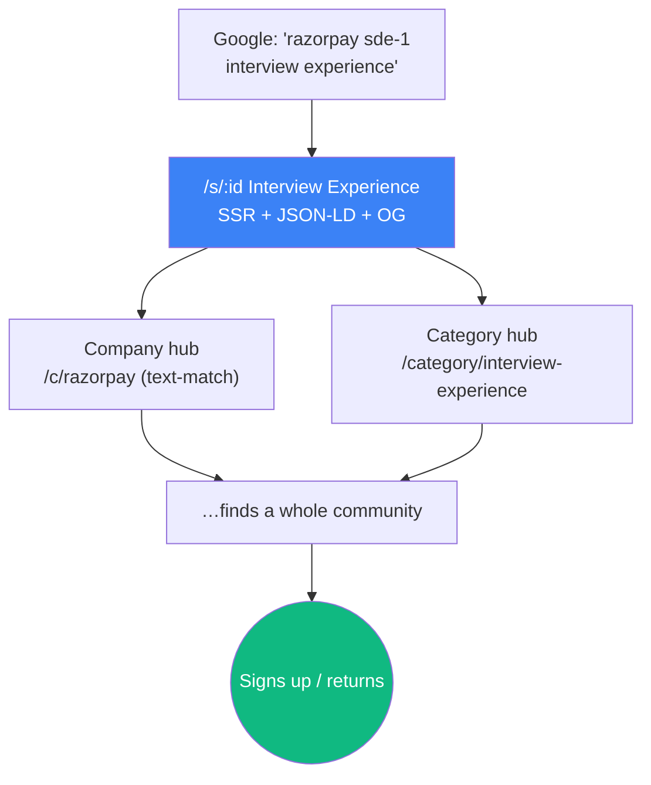
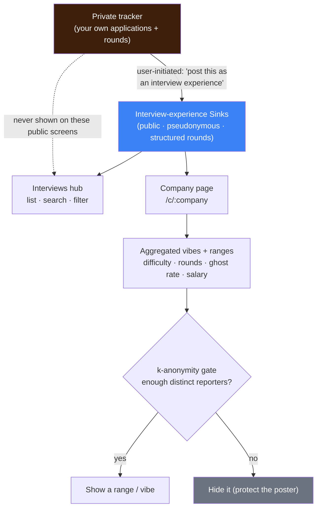
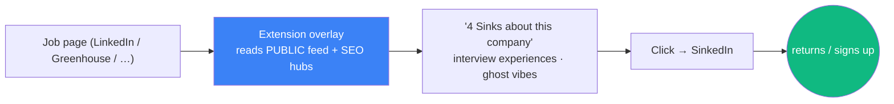
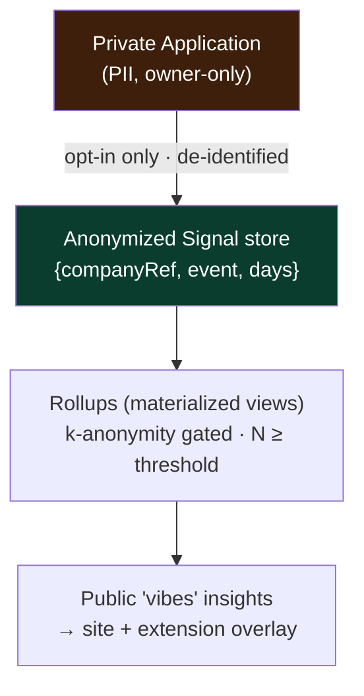
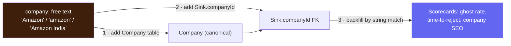

# Phase 3 — Community depth & growth ⬜ (gated)

← [Phase 2](phase-2-retention.md) · [Index](README.md) · Next: [Phase 4 — Trust & gamification](phase-4-trust-and-gamification.md)

> **Goal:** deepen the community and turn it into a growth engine — better discovery, richer participation, and **content that pulls new people in from search.** (Formerly "the Ghost Index" phase — reframed to community + SEO; the Index survives only as an optional fork below.)
>
> **Entry gate:** an active community with recurring posting/voting/commenting/reacting (Phase 2 retention proven).
>
> **Why this phase is the pivotal expansion:** it's the first phase that serves people who only *read* — a far larger group than posters — via discovery and SEO. That's the real growth unlock.

## What the user can newly do
Discover via hot / top / rising, per-category hubs, and search · follow categories/users and get a personalized "your feed" · browse "Sinks mentioning [company]" · see that community intel **on the job page itself** through the companion extension's overlay · **ask for and give referrals** (Phase 3.5, decision-gated — see below) · and — the big one — **arrive from Google** onto a rich interview-experience page and find a whole community behind it.

---

## Data model additions

```mermaid
erDiagram
    User ||--o{ Follow : creates
    Sink ||--o| InterviewExperience : "detail (Interview category)"
    InterviewExperience ||--o{ InterviewRound : "ordered rounds"
    Sink ||--o{ ModerationAction : "may receive"

    Follow { string id PK; string userId FK; enum targetType "CATEGORY|USER"; string targetId }
    InterviewExperience { string sinkId PK; string company; string role; enum difficulty; enum stageReached; enum outcome; string questions }
    InterviewRound { string id PK; string interviewExperienceId FK; int position; string title; string description }
    ModerationAction { string id PK; string moderatorId; string targetType; string targetId; enum action "HIDE|RESTORE|WARN|SUSPEND"; string reason; datetime createdAt }
```
Plus **Postgres full-text search** indexes (`tsvector` on Sink title/body) — no new infra.

> **Captured refinement (session 2026-08-23):** rounds are a **structured list, not a count.** Replace the earlier `InterviewExperience.rounds: int` with a child `InterviewRound { position, title, description }` table (e.g. "Round 1: DSA screen" / "2 LeetCode-mediums, 45 min"). The composer gains a repeatable "add round" block; the `/s/:id` page renders them as a numbered list; the company hub reads them structured. `company` stays free text on the Sink (per the no-Company-table rule). This is the data hygiene the Phase-1 composer already nudges toward. *(Ghost-Index fork only:* a `Company` table + `Sink.companyId`.) *(Aggregate-insights fork only:* an anonymized, **opt-in `Signal` store** — `{ companyRef, event "GHOSTED|RESPONDED|INTERVIEW|OFFER", days, salaryRange }` — kept **separate from the private tracker, with no re-identifying link**.)

---

## Build

### Discovery & sorting `[in-plan]`
Hot / top / rising algorithms; **category hubs** (a page per category — all Interview Experiences, all Bad-Boss stories); **search** via Postgres full-text search (upgrade to a dedicated engine only if genuinely outgrown).

### Notifications (full) `[expand]`
Everything from [Phase 2](phase-2-retention.md) (in-app reply/buoy/reaction/poll bell) **+ opt-in email on those events**, thread-activity digests, follow-based alerts, and **per-type preferences**.
- **Per-event email is opt-in and batched, never default.** "Someone upvoted you" emails are a fatigue + deliverability trap — start users on in-app + the weekly digest (Phase 2), and let them *turn on* email per type here. Batch bursts (e.g. one email per thread per hour, not one per reply).
- Extend `EmailPrefs` from a single `weeklyDigest` flag to **per-type toggles** (`replyEmail`, `milestoneEmail` for buoy/reaction milestones, `followAlertEmail`), still unsubscribe-first, still via Resend.
- **Milestone, not per-tap:** email on *"your Sink hit 50 buoys"*, not on every single vote — solidarity + return pull without the spam.

### Following / feed personalization `[in-plan]`
Follow categories or users; "your feed" vs "everything."

> **Captured refinement (session 2026-08-23):** the pseudonymous **profile becomes a two-column identity page.** Right rail = an identity card (avatar, handle, member-since, **Aura** with a small breakdown, **followers / following** counts that open lists, a **Follow** button hidden on your own profile, post + comment counts, optionally top categories). Middle = tabs **Sinks** (author-scoped reuse of the feed) and **Comments**. All pseudonymous, no PII, never the private tracker. Needs: user→user `Follow`, a `GET /users/search?q=` (handle contains) wired to the header search, and a cached `User.aura`. **Aura formula sketch:** `buoys_on_your_sinks + buoys_on_your_comments + 2·posts` now; the `+10 verified interview exp` term waits for [Phase 4](phase-4-trust-and-gamification.md) verification (no verification mechanism exists before then, so the bonus is deferred, not built on a placeholder).

### Company mentions as soft tags `[in-plan]`
Since `company` is free text, a lightweight "Sinks mentioning Amazon" text-match view — useful, low-effort, no canonical data.

> **Captured update (2026-08-25):** the centralized **`Company` entity now exists** (built in Phase 2 for the tracker: deduped by `normalizedName`, optional `domain`, seeded ~9.6k from `prisma/data/companies.json`, grown by find-or-create, with autocomplete at `GET /api/v1/companies?q=`). **`Sink.companyId` links Sinks to it** (resolved on create/edit; a `@@index([companyId])` exists), and `Application.companyId` links tracker rows too. So the company pages/hubs can query **"all Sinks about Razorpay" by FK** (reliable), not only by text-match, and company **logos** come from the domain via Logo.dev (nothing stored). Net effect on the plan: the Ghost-Index-fork's "add a `Company` table + `Sink.companyId`" step is **effectively done** — what remains for real per-company scorecards is only the **aggregation + k-anonymity + opt-in signal pipeline**, not the identity layer.

### Interview-Experience Hub + SEO `[new · retention #1 — the primary acquisition engine]`
A **structured template** for the Interview Experience category (rounds, questions asked, difficulty, stage reached, outcome, company) rendered as **SSR, SEO-indexed pages** with **JSON-LD structured data**, plus per-company / per-category hubs.



**Why it wins:** validated by scale — AmbitionBox (~6.4M/mo) and GeeksforGeeks (~35M/mo) were built largely on this exact search intent. They're soulless data dumps; SinkedIn's wedge is the **same SEO surface wrapped in a community with a voice.** It also serves employed lurkers (prep before they're even hunting) — the wide-door audience. **Pull *basic* SEO earlier** (clean URLs, per-Sink meta/OG, sitemap-per-hub — the SSR + sitemap groundwork already exists) since SEO compounds slowly; save the full structured hub for here.

#### What the user sees + does (Interviews & Companies screens) `[captured 2026-08-24]`

**Interviews screen** — a browsable, searchable list of interview experiences:
```
┌──────────────────────────────────────────────────┐
│  Interview Experiences               [ Search 🔍 ]│
│  Filter:  [Company ▾] [Role ▾] [Difficulty ▾]     │
├──────────────────────────────────────────────────┤
│  Razorpay · SDE-2 · Hard · Rejected        ▲ 156  │
│  "5 rounds, the machine-coding round was brutal"  │
│  Google · L4 · Medium · Offer              ▲ 89   │
│  Amazon · SDE-1 · Hard · Ghosted           ▲ 44   │
└──────────────────────────────────────────────────┘
```
Click one → the full experience with **structured rounds** (the public rounds, distinct from the private tracker's rounds):
```
┌──────────────────────────────────────────────────┐
│  Razorpay · SDE-2 · Bangalore · Rejected   ▲ 156  │
│  Round 1 · Online Assessment   2 DSA, 90 min      │
│  Round 2 · Machine Coding      Build a logger     │
│  Round 3 · System Design       Design a wallet    │
│  Round 4 · Hiring Manager      Behavioral         │
│  💬 52 comments      🔖 Save      ↗ Share          │
└──────────────────────────────────────────────────┘
```
*Do:* search/filter by company, role, difficulty, outcome; read round-by-round; vote / comment / save / share; **post your own**; arrive from Google (SEO-indexed).

**Companies screen** — a directory, then a per-company page of **community intel, never listings**:
```
┌──────────────────────────────────────────────────┐
│  Razorpay                              [ Follow + ]│
│  What the community reports (aggregated)          │
│  Interview difficulty   ●●●●○  ~Hard              │
│  Typical rounds         ~4                         │
│  Ghost vibes            "often"  (from 24 reports) │
│  Salary (SDE-2)         ~₹30–45 LPA  (range)       │
│  [ Sinks ]  [ Interviews ]  [ Salaries ]          │
└──────────────────────────────────────────────────┘
```
*Do:* search a company; see aggregated difficulty / typical rounds / ghost vibes / salary **ranges**; browse its Sinks / interviews / salaries; **follow** the company.

**Where the data comes from, and the guardrails:**

- **Never a job board:** company pages show *what people experienced*, not open roles.
- **Never exact, never individual:** stats are ranges/vibes, and hidden below a k-anonymity threshold.
- **Private tracker stays private:** it never appears here; the only link is a *user-initiated* "share as interview experience" bridge (fills these hubs from real usage, the content flywheel).

#### Proposed additions worth considering `[opinion, 2026-08-24]`
- **Per-company/role "questions asked" bank** — aggregate the `questions`/round notes across experiences into "commonly asked at Razorpay SDE-2". Direct output of the structured rounds; huge for prep + SEO. **Recommend.**
- **Tracker → interview-experience bridge** — when a user logs an Interview status or rounds in their private tracker, one-tap "share this as an experience" (pre-filled, they choose what's public). Solves the hubs' **cold-start** and turns tracker usage into public content. **Recommend (high leverage).**
- **"Prepping here" focused view** — from a company page, a button that pulls its interview experiences + question bank into one prep view. Serves the reader before they even apply (the wide-door lurker). **Nice-to-have.**
- Deliberately **not** adding: a salary product, filters/percentile charts, exact per-company scorecards (Ghost-Index fork only), or anything that reads as job listings.

### Referrals — ask / give / post `[new · 2026-08-26 · the two-sided viral engine · DECISION-GATED]`

> **⚠️ Do not build this without a design conversation first.** When Phase 3 starts, Claude must **ask the owner the open questions below** before writing any referral code. This is the highest-leverage *and* highest-risk feature in the phase: done right it is the two-sided viral engine; done cold it is a ghost town that dies on arrival.

**What it is:** members ask for a referral at a company, and members who work there (or know someone) give one. Three surfaces: *ask for a referral* (a request tied to a `Company` + role), *offer/give a referral* (respond to a request, or post "I can refer at X"), and *post a referral opening* ("my team is hiring, DM-free flow").

**Why it fits SinkedIn (and why it's viral+helpful):**
- It is **inherently two-sided and social** — the only feature here that grows because *both* sides must show up. Referrals are the single most effective way people actually land jobs, so the help is real, not cosmetic.
- SinkedIn's wedge is a **community of real, candid employees** venting about work. That community *is* the referrer pool a cold referrals product can never bootstrap. So referrals is an **expansion of an existing community, not a marketplace built from zero.**
- It compounds the rest of the phase: interview experiences + company pages + "people from X are here" → a natural "ask them for a referral" call to action.

**The hard problem — liquidity / cold-start.** A referrals feature with no referrers is worse than nothing (it visibly fails). So the **strict ordering rule:** community + interview-SEO must be proven *first* (real employees present), *then* turn on referrals. Never launch it into an empty room.

**Pseudonymity tension (the core design question).** A referral eventually needs a real identity somewhere (a recruiter needs a real name/resume). But SinkedIn's whole promise is pseudonymity. So the bridge must be **explicit, per-referral, user-confirmed** — the seeker chooses to reveal their real details to one specific referrer for one specific request, and it never leaks back to their public handle. This is the same one-way-bridge principle as "post a Sink from this application," applied to identity. **Getting this wrong breaks the pseudonymity wall — the project's hardest boundary.**

**Owner decisions (locked 2026-08-27 — a full brainstorm still happens before building):**
- ✅ **Referrer verification REQUIRED.** Only a referrer who has **verified they work at the company** (e.g. a code sent to a `name@company.com` address; ties to the Phase-4 verification work) can receive a seeker's real identity. Unverified = never sees real PII. This is the guard against the fake-referrer / resume-harvesting phishing vector.
- ✅ **Minimal, per-referral, consensual identity handoff.** The seeker shares only **name + email + resume** (from the private `resumes` bucket), only with the **one referrer they accept**, only for **that one referral** — never tied back to their public handle. Same one-way-bridge principle as "post a Sink from this application," applied to identity.
- ✅ **Incentive = Auras for helping**, not money. Referrers earn reputation ([Auras](phase-4-trust-and-gamification.md), helpfulness kind) for giving referrals. Do NOT build the incentive around company referral bonuses.
- ✅ **No paid referrals — keep it clean.** Explicitly forbid selling/charging for a referral (policy-safe, on-brand, removes the sleaziest abuse vector). Enforce in terms + moderation.
- ⏳ **Matching model — DECIDE LATER** (open request board by `Company` + role vs. targeted ask; seniority/skills matching). Revisit at the brainstorm.

**Still to settle at the pre-build brainstorm:** the exact verification mechanism (email-code now vs. full Phase-4 DKIM), the matching model (above), the moderation story for the referral thread (a new social surface — README rule), and anti-spam limits on requests/offers.

**Data model (unchanged):** referrals hang off the existing `Company` entity — request = `{ companyId, role, seekerUserId, status }`, offer = `{ requestId or companyId, referrerUserId, verified }`. **Scope guard:** stays "connect two humans, then get out of the way" — never creeps toward a job board / ATS (an explicit non-goal).

**Recommendation:** ship as an explicit **Phase 3.5**, gated behind proven Phase-2 retention *and* an active Phase-3 community, with the locked decisions above. **Run a dedicated brainstorm session before writing any referral code** (settle the ⏳ items), and ship it *with* its moderation story (per the README rule). Never launch it into an empty room.

### Moderation console `[new · required at this scale]`
A report **queue**, hide/restore, user warnings/suspensions, spam heuristics. Manual review doesn't scale past a point — build the tooling *before* the community outgrows it.

### Companion extension — community overlay `[new · the acquisition loop — the real differentiator]`
The [Phase-2 capture extension](phase-2-retention.md) grows a *second* job: on any job/company page, surface **SinkedIn community content in-context** — "🌊 4 Sinks about this company", interview experiences, ghost-timer vibes — right where people are hunting. This turns a private utility into an **acquisition channel** that pulls readers back to the site, and it's the one thing generic trackers (Teal / Huntr / Simplify) **can't copy — they have no community.** If you build the extension for any reason, this is *the* reason.


- Reads from the **public** feed / SEO hubs only — pseudonymous, **no PII** on the overlay.
- It *is* the interview-experience hub, delivered contextually — a direct multiplier on the Phase-3 SEO work.
- Company matching is fuzzy free-text first (vibes); precise per-company needs the canonical fork below.

### Aggregate insights & the signal pipeline `[new · OPTIONAL · opt-in · ties to the Ghost Index]`
Turn *opted-in* tracker events into honest **community insights** (ghost rate, time-to-reply, salary ranges) — the on-brand version of "crowd intel," and the bridge from the private tracker to the Ghost Index.


- **Two stores, hard-separated (the pseudonymity wall as a pipeline):** the private `Application` (PII, owner-only) and a separate **anonymized `Signal`** store with *no* re-identifying link. Contributing to aggregates is a **separate explicit opt-in**, distinct from *using* the tracker.
- **k-anonymity gate:** never surface a company stat below N distinct users (both a privacy guard *and* an honesty guard — "3 reports about a 4-person startup" both identifies people and lies). Present as **vibes / ranges, never false precision** — consistent with the [Phase-2 "not alone" counter](phase-2-retention.md) and the SEO integrity rule.
- **Cross-board dedupe** (the Phase-2 `dedupeKey`) prevents triple-counting the same job seen on three boards.

> **⚠️ Real, named-company scorecards = the Ghost Index fork (below), not a small feature.** Fuzzy text-match gives "vibes" for free; precise per-company ghost rates need canonical company identity **plus** k-anonymity, legal review, and anti-poisoning. Don't drift into it — commit deliberately.

#### Two viral surfaces for this data `[idea · 2026-08 · brainstorm before building]`
Both are *presentation layers* over the k-anonymity-gated rollups above — build them only once the signal pipeline and legal review exist. **Brainstorm the exact framing/thresholds before building.**
- **Company Report Cards** — a per-company page: *"Amazon: 42% ghost rate, median 18 days to reply, 5.2 interview rounds."* The single most viral + useful thing here (nobody has honest ghost data) and **un-copyable** without this community. Named-company stats = the Ghost Index fork; only ever above the k-anonymity N, always framed as ranges/vibes, never false precision. This is a serious feature with legal weight (India **DPDP** / defamation), not a quick win.
- **"Market Weather"** — a live, aggregate vibe gauge of the whole job market from community activity: *"⛈️ Rough out there: ghost sightings up 20%, response times slowing this week."* No named companies, so **much lower legal risk** than report cards, and it's a great recurring shareable + press hook. Overlaps the [Phase-5 "market weather" moments](phase-5-growth-mechanics.md); this is its data source.

> **💡 Captured idea — Company Report Cards (the Ghost Index as THE moat) `[brainstorm before building]` (2026-08-26):** when this pipeline is built, surface it as a **per-company report card**: *"Amazon — 42% ghost rate · median 18 days to reply · ~5 interview rounds · salary band ₹X–Y (N reports)."* Why it's the long-term reason SinkedIn matters: **nobody has honest ghost data**, it is inherently viral ("which companies ghost the most?"), genuinely useful to job-seekers, and **un-copyable** — it needs your community and their opt-in data. It's the payoff of the FK-backed `Company` entity + `Sink.companyId` (already built) + this opt-in `Signal` pipeline. Hard gates before ANY of it ships: opt-in, k-anonymity (N ≥ threshold), **legal review (India DPDP / defamation)**, anti-poisoning, and honest ranges over false precision. Brainstorm the exact card, the abuse model, and the legal posture before building — this is the one feature where getting it wrong is a lawsuit, not a bug.

---

## The optional fork — bring back the Ghost Index (deliberate, TypeScript)

Only if, *once you have volume*, aggregate company data is worth the added scope:



- Built as a **TypeScript/Node service** (read-heavy, bounded, doesn't gate the core product) — **not Python.**
- A **real added-scope commitment, decided on purpose.** The community succeeds without it; the Phase-2 text-match "not alone" counter already covers the emotional need.
- **Fed by the opt-in signal pipeline** (see *Aggregate insights* above): the extension/tracker emit de-identified events; scorecards are **k-anonymity-gated rollups**, never computed from raw PII.
- **Legal weight is real:** named-company stats are review-site territory — India **DPDP** consent, k-anonymity thresholds, honest "user-reported" framing, anti-poisoning, and a lawyer conversation *before* launch. Store only *derived signals*, **never** republished (copyrighted) job descriptions.
- [Phase 4](phase-4-trust-and-gamification.md) verification would later *weight* this data to make it credible (a verified report counts for more, which is also the anti-poisoning defense).

---

## 🔧 Build notes — services & decisions (brief)
*A build log for future-you: per service, what we build, the key decision, and why.*
- **Discovery & sorting** — hot / top / rising as ranking queries over `score` + recency, hot lists materialized. **Decision:** compute in Postgres; rate-limits now, vote-ring detection later. **Why:** ranking invites gaming.
- **Category / company hubs** — SSR server components over existing data; company via fuzzy text-match. **Decision:** ship hubs early (pull basic SEO forward). **Why:** SEO compounds slowly.
- **Search** — **Postgres full-text** (`tsvector`). **Decision:** FTS, not a dedicated engine. **Why:** free and enough for a long time.
- **Interview-Experience hub + SEO** — structured template, SSR + **JSON-LD**, per-hub sitemaps, canonical tags. **Decision:** indexed pages must be *real* experiences. **Why:** fake/AI pages poison trust + search reputation.
- **Companion extension overlay** — injects a community-intel card on job pages, reading the **public** feed/hubs. **Decision:** public/pseudonymous data only. **Why:** the acquisition loop without touching PII.
- **Aggregate signal pipeline** — separate anonymized `Signal` store, **opt-in**, k-anonymity-gated rollups (materialized views), cross-board dedupe via `dedupeKey`. **Decision:** two hard-separated stores; vibes/ranges only. **Why:** privacy + honesty + legal (DPDP / defamation).
- **Moderation console** — report queue, hide/restore, warn/suspend, spam heuristics. **Decision:** build the tooling *before* the community outgrows manual review. **Why:** manual review doesn't scale.
- **Notifications (full)** — opt-in, batched, per-type email via Resend; `EmailPrefs` per-type toggles. **Decision:** milestone/batched, never per-tap. **Why:** fatigue + deliverability.

---

## Tradeoffs & decisions
- **SEO is a content-integrity commitment:** indexed pages must be *real* experiences. Fake/AI-filled interview pages poison trust and search reputation — never do it.
- **Ranking invites gaming:** hot/top need basic anti-manipulation (vote-ring detection later; rate limits now).
- **The Ghost Index fork is lossy + ongoing:** backfilling free-text → canonical is imperfect and never "done" — only commit if the data *product* is genuinely wanted.
- **Search infra restraint:** Postgres FTS is free and enough for a long time — don't reach for a dedicated engine prematurely.
- **Aggregation is a legal + integrity surface, not just code:** community stats need explicit opt-in, k-anonymity gating, honest "vibes/ranges" framing, and (for named companies) legal review — the same "real data only" bar as SEO. Aggregating others' *job postings* into a redistributed dataset also risks site-ToS / copyright trouble; store derived signals, not scraped descriptions.
- **Aggregate poisoning:** public per-company numbers invite manipulation (a competitor tanks a company's ghost rate) — needs rate limits, per-user weighting, and later verification-weighting ([Phase 4](phase-4-trust-and-gamification.md)).
- **Extension maintainability:** the overlay reads *public* content and the capture uses **structured-data-first** adapters — a site redesign degrades gracefully (fall back to JSON-LD/OG) rather than breaking. Keep the supported-site list deliberate; LinkedIn/Workday stay the fragile, opt-in tier.

## Safety this phase
Moderation console; anti-spam heuristics; SEO content integrity; report-queue SLAs. Aggregate insights are **opt-in + k-anonymity-gated + anti-poisoning**; the extension overlay uses **public, pseudonymous data only** (no PII leaves the private world).

## Exit gate
**Measurable organic growth** — content pulling in new users via search/shares, and discovery/notifications lifting repeat engagement.
