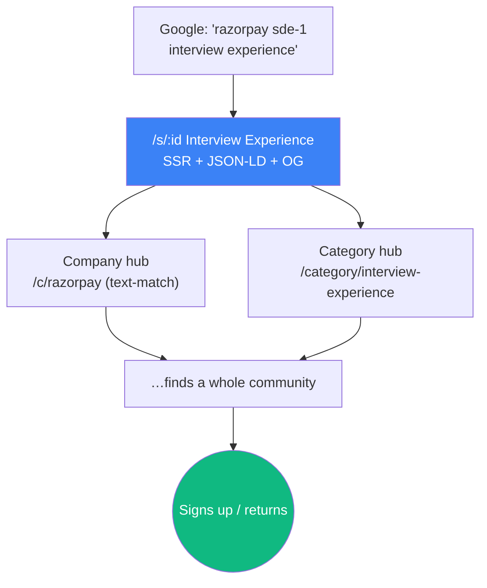
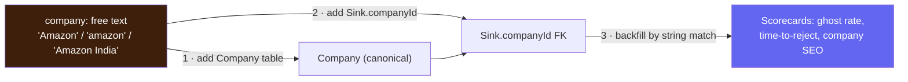

# Phase 3 — Community depth & growth ⬜ (gated)

← [Phase 2](phase-2-retention.md) · [Index](README.md) · Next: [Phase 4 — Trust & gamification](phase-4-trust-and-gamification.md)

> **Goal:** deepen the community and turn it into a growth engine — better discovery, richer participation, and **content that pulls new people in from search.** (Formerly "the Ghost Index" phase — reframed to community + SEO; the Index survives only as an optional fork below.)
>
> **Entry gate:** an active community with recurring posting/voting/commenting/reacting (Phase 2 retention proven).
>
> **Why this phase is the pivotal expansion:** it's the first phase that serves people who only *read* — a far larger group than posters — via discovery and SEO. That's the real growth unlock.

## What the user can newly do
Discover via hot / top / rising, per-category hubs, and search · follow categories/users and get a personalized "your feed" · browse "Sinks mentioning [company]" · and — the big one — **arrive from Google** onto a rich interview-experience page and find a whole community behind it.

---

## Data model additions

```mermaid
erDiagram
    User ||--o{ Follow : creates
    Sink ||--o| InterviewExperience : "detail (Interview category)"
    Sink ||--o{ ModerationAction : "may receive"

    Follow { string id PK; string userId FK; enum targetType "CATEGORY|USER"; string targetId }
    InterviewExperience { string sinkId PK; string company; string role; int rounds; enum difficulty; enum stageReached; enum outcome; string questions }
    ModerationAction { string id PK; string moderatorId; string targetType; string targetId; enum action "HIDE|RESTORE|WARN|SUSPEND"; string reason; datetime createdAt }
```
Plus **Postgres full-text search** indexes (`tsvector` on Sink title/body) — no new infra. *(Ghost-Index fork only:* a `Company` table + `Sink.companyId`.)

---

## Build

### Discovery & sorting `[in-plan]`
Hot / top / rising algorithms; **category hubs** (a page per category — all Interview Experiences, all Bad-Boss stories); **search** via Postgres full-text search (upgrade to a dedicated engine only if genuinely outgrown).

### Notifications (full) `[expand]`
Everything from [Phase 2](phase-2-retention.md) + thread-activity digests + follow-based alerts + per-type preferences.

### Following / feed personalization `[in-plan]`
Follow categories or users; "your feed" vs "everything."

### Company mentions as soft tags `[in-plan]`
Since `company` is free text, a lightweight "Sinks mentioning Amazon" text-match view — useful, low-effort, no canonical data.

### Interview-Experience Hub + SEO `[new · retention #1 — the primary acquisition engine]`
A **structured template** for the Interview Experience category (rounds, questions asked, difficulty, stage reached, outcome, company) rendered as **SSR, SEO-indexed pages** with **JSON-LD structured data**, plus per-company / per-category hubs.



**Why it wins:** validated by scale — AmbitionBox (~6.4M/mo) and GeeksforGeeks (~35M/mo) were built largely on this exact search intent. They're soulless data dumps; SinkedIn's wedge is the **same SEO surface wrapped in a community with a voice.** It also serves employed lurkers (prep before they're even hunting) — the wide-door audience. **Pull *basic* SEO earlier** (clean URLs, per-Sink meta/OG, sitemap-per-hub — the SSR + sitemap groundwork already exists) since SEO compounds slowly; save the full structured hub for here.

### Moderation console `[new · required at this scale]`
A report **queue**, hide/restore, user warnings/suspensions, spam heuristics. Manual review doesn't scale past a point — build the tooling *before* the community outgrows it.

---

## The optional fork — bring back the Ghost Index (deliberate, TypeScript)

Only if, *once you have volume*, aggregate company data is worth the added scope:



- Built as a **TypeScript/Node service** (read-heavy, bounded, doesn't gate the core product) — **not Python.**
- A **real added-scope commitment, decided on purpose.** The community succeeds without it; the Phase-2 text-match "not alone" counter already covers the emotional need.
- [Phase 4](phase-4-trust-and-gamification.md) verification would later *weight* this data to make it credible.

---

## Tradeoffs & decisions
- **SEO is a content-integrity commitment:** indexed pages must be *real* experiences. Fake/AI-filled interview pages poison trust and search reputation — never do it.
- **Ranking invites gaming:** hot/top need basic anti-manipulation (vote-ring detection later; rate limits now).
- **The Ghost Index fork is lossy + ongoing:** backfilling free-text → canonical is imperfect and never "done" — only commit if the data *product* is genuinely wanted.
- **Search infra restraint:** Postgres FTS is free and enough for a long time — don't reach for a dedicated engine prematurely.

## Safety this phase
Moderation console; anti-spam heuristics; SEO content integrity; report-queue SLAs.

## Exit gate
**Measurable organic growth** — content pulling in new users via search/shares, and discovery/notifications lifting repeat engagement.
