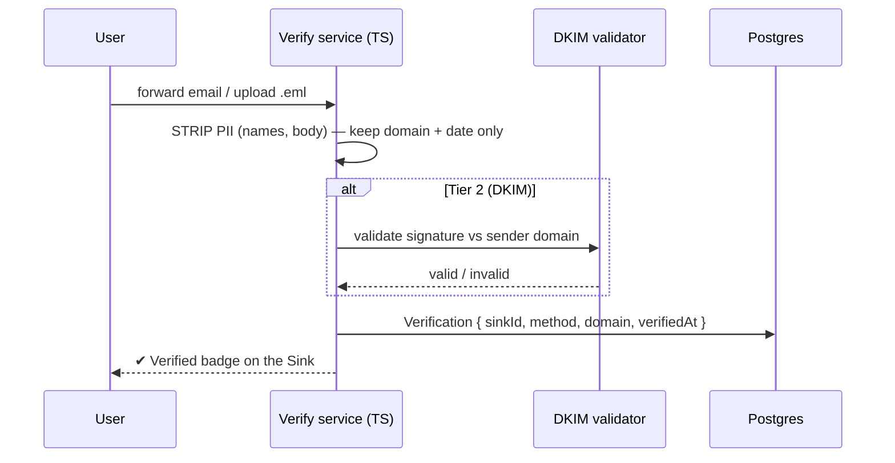

# Phase 4 — Trust & gamification ⬜ (gated)

← [Phase 3](phase-3-depth-and-growth.md) · [Index](README.md) · Next: [Phase 5 — Growth mechanics](phase-5-growth-mechanics.md)

> **Goal:** deepen engagement and data quality via **verification (trust)** and **rewards (engagement)** — amplifiers of an already-working community, pointless before there's one to amplify.
>
> **Entry gate:** an active, growing community with recurring contribution (Phase 3 organic growth proven).

## What the user can newly do
**Verify a Sink** — prove it's real *without* revealing identity · **earn Auras** for helping and persisting · **climb rank tiers** · build and wear a **resilience streak**.

> **Felt experience:** "My rejections are verified so people take my company reports seriously, I'm a 'Deep Water' rank after surviving 30 rejections, and I've got more Aura from *helping* people than from my own Ls."

> ## 🚫 The hard rule (never negotiable)
> Auras, streaks, and ranks reward **helping others** and **persistence** — **never collecting rejections.** No "most rejected" leaderboard. Gamifying failure is off-brand and harmful; this is a wellbeing + integrity line. Frame everything as **resilience / comeback**, never a failure scoreboard.

---

## Data model additions

```mermaid
erDiagram
    Sink ||--o| Verification : "may have"
    User ||--o{ AuraEvent : earns
    User ||--|| RankState : has

    Verification { string sinkId PK; enum method "HONOR|DKIM"; string domain; datetime verifiedAt }
    AuraEvent { string id PK; string userId FK; enum kind "HELPFUL_COMMENT|INTEL|SUPPORT|PERSISTENCE"; int weight; datetime createdAt }
    RankState { string userId PK; int aura; int streakDays; datetime lastActiveAt; string tier }
```
- `Verification` stores **only domain + date** — PII (names, body of the email) is stripped on ingest.
- `AuraEvent.kind` is a fixed enum weighted toward **helpfulness/persistence** — there is deliberately **no** "rejection" kind that earns points.

---

## Verified Sink badge `[in-plan]`

Forward the rejection/offer email (or upload the `.eml`) → validate authenticity → badge. Start honor-system **Tier 1** (low friction, some trust), upgrade to real **DKIM** validation (high trust).



Trust + a status layer in one; makes interview intel and company mentions carry more weight (and, if the [Ghost Index fork](phase-3-depth-and-growth.md) was taken, weights that data credibly). **Never require verification to post.**

This weighting is also the **anti-poisoning defense** for the [aggregate scorecards](phase-3-depth-and-growth.md): a *verified* report counts for far more than an anonymous one, so trying to game a company's ghost rate with fake reports gets diluted out.

---

## Auras (reputation) `[in-plan]`
Reddit-style karma branded **"Auras"**, weighted toward **helpfulness** (advice, interview intel, support, referrals) and **persistence** — never toward collecting rejections. Derivable from existing signals (buoys on helpful content, accepted advice); surfaced now via the `AuraEvent` ledger.

## Rank tiers `[in-plan]`
Puddle → … → **Mariana Trench**, as light identity earned by contribution + survival, never by failure count.

## Resilience streak `[new · retention #5 — the safe gamification]`
Reward *showing up* through the grind — "12 days still swimming", survival milestones — as light identity. Pairs with ranks + Auras. Gives a habit/identity reason to return **without ever rewarding failure itself.**

The streak counts **showing up** — opening the app, logging a tracked application, helping someone — **never rejections.** The [Phase-2 tracker](phase-2-retention.md)'s applied-cadence is a natural, honest input: the number is "days you kept swimming," not "rejections collected."

---

## 🔧 Build notes — services & decisions (brief)
*A build log for future-you: per service, what we build, the key decision, and why.*
- **Verification service (TS)** — email forward / `.eml` upload → **strip PII on ingest** → store only `{ domain, date }`. **Decision:** honor-system Tier 1 first, real **DKIM** Tier 2 later. **Why:** low friction to launch, cryptographic trust when it matters; never gate posting on it.
- **Auras ledger** — append-only `AuraEvent`, weighted by `kind`. **Decision:** derive from existing signals (buoys on helpful content, accepted advice) + explicit events; **no "rejection" kind exists.** **Why:** reward helping/persistence, hard to fake, structurally impossible to gamify failure.
- **Rank tiers** — computed from Aura + streak (Puddle → Mariana Trench). **Decision:** **derived / materialized**, not a source of truth. **Why:** cheap, recomputable, no drift.
- **Resilience streak** — `RankState.streakDays` from "showing-up" events. **Decision:** input = activity/tracker cadence, **never** rejection count. **Why:** the hard rule.
- **Anti-gaming** — rate caps, self-vote exclusion, sockpuppet heuristics, verification-weighting of aggregates. **Decision:** build *alongside* the reward system, not after. **Why:** if gamification is gameable, people optimize for points over honesty.

---

## Tradeoffs & decisions
- **Verification friction vs. trust:** honor-system Tier 1 first; DKIM later. Never gate posting on it.
- **Gamification can corrupt authenticity:** if Auras/streaks are gameable, people optimize for points over honesty. Weight toward hard-to-fake helpfulness; add anti-gaming (rate caps, self-vote exclusion, sockpuppet heuristics).
- **The failure-gamification trap:** it's *tempting* to badge "rejections survived" — keep it framed as resilience/comebacks, never a rejection leaderboard. (See the hard rule above.)

## Safety this phase
Anti-gaming for Auras (rate caps, sockpuppet detection); PII stripping in verification; fake-`.eml` abuse mitigated by the DKIM tier.

## Exit gate
Verified Sinks flowing (and, if forked, weighting the Ghost Index); gamification measurably lifting return/contribution **without corrupting authenticity.**
