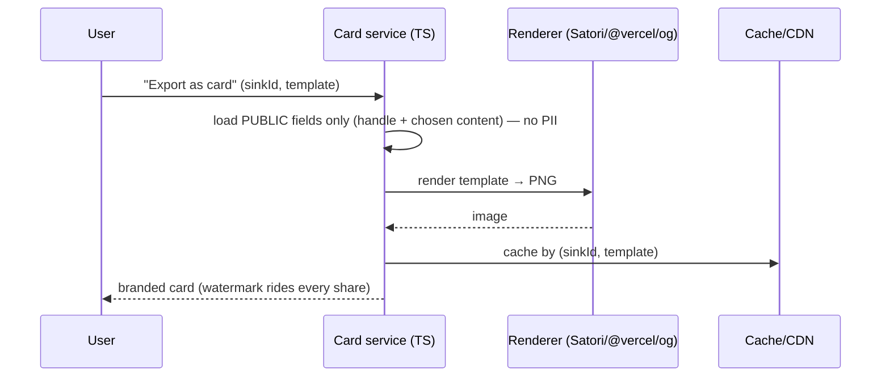

# Phase 5 — Growth mechanics ⬜ (gated)

← [Phase 4](phase-4-trust-and-gamification.md) · [Index](README.md) · Next: [Phase 6+ — AI & monetization](phase-6-ai-and-monetization.md)

> **Goal:** make SinkedIn spread *beyond* itself — turn users into distribution. You only amplify a product that already retains; by now the bucket holds water, so growth compounds instead of leaking.
>
> **Entry gate:** proven retention ([Phase 2](phase-2-retention.md)) + active community ([Phase 3](phase-3-depth-and-growth.md)).

## What the user can newly do
Export any Sink/Comeback as a clean, **branded card image** for Instagram / X / LinkedIn · export a private **funnel recap** card of their own hunt (opt-in) · get **featured** (Hall of Fame / Sink of the Week) · share **"market weather"** aggregate moments.

> **Felt experience:** "I posted my Comeback card to LinkedIn and Instagram, it got more engagement than anything I've ever shared, and three friends signed up." — the anti-LinkedIn spreading *through* LinkedIn, where layoff/comeback posts already go viral.

---

## Data model additions

```mermaid
erDiagram
    User ||--o{ Share : creates
    Sink ||--o| FeaturedSink : "may be"
    Share { string id PK; string userId FK; string sinkId FK; enum channel "IG|X|LINKEDIN|LINK"; datetime createdAt }
    FeaturedSink { string sinkId PK; enum kind "HALL_OF_FAME|SINK_OF_WEEK"; datetime featuredAt }
```
Plus weekly-stats snapshots (built from *existing* aggregate counts — **not** the Ghost Index).

---

## Shareable card export `[in-plan]` — rendered in TypeScript

Any Sink/Comeback → a branded image. Rendered with a **TypeScript** image pipeline (e.g. Satori / `@vercel/og`, or a Node canvas renderer) — **no new language.**



Your watermark rides every share; the card is the marquee export at the user's highest-emotion moment.

## Comeback card `[in-plan · retention #4 (card)]`
The Comeback flow's post (from [Phase 2](phase-2-retention.md)) exported as the flagship shareable — users become marketing exactly when they're proudest.

## Hall of Fame / Sink of the Week `[in-plan]`
Curated, screenshot-bait, a weekly return reason. Curation protects quality (unmoderated "trending" surfaces the wrong thing).

## Market weather / aggregate stats `[in-plan]`
"4,201 Sinks this week, ghost rate up 12%" — press-friendly, recurring, shareable. Built from existing aggregate counts and the opt-in `Signal` rollups from [Phase 3](phase-3-depth-and-growth.md) (k-anonymity-gated) — **not** the Ghost Index.

## Personal funnel recap card `[new · optional]`
The user's *own* hunt as a shareable — "60 applications · 40 rejections · 8 ghosts · 1 offer · 6 months." It's their data, they choose to share it, and it's the Comeback story in numbers.
- **Opt-in and PII-safe:** renders only the user's own aggregate counts + handle; company names appear **only if the user explicitly includes them.** The pseudonymity wall applies to shareables (same rule as the Comeback card).
- Reuses the same TS render pipeline (Satori / `@vercel/og`) as the Sink cards — no new tech.

## The extension as a distribution surface `[new · optional]`
The companion extension's **Chrome Web Store listing is itself an acquisition channel** — people search "job tracker" and find SinkedIn. Treat the listing (screenshots, the community-overlay demo) as growth surface, and let the overlay's "see the community" nudge convert extension-only users into site users.

---

## 🔧 Build notes — services & decisions (brief)
*A build log for future-you: per service, what we build, the key decision, and why.*
- **Card render service (TS)** — `POST (sinkId|recap, template)` → PNG. **Decision:** render with **Satori / `@vercel/og`** (or Node canvas), load **public fields only**, cache by `(id, template)`. **Why:** stays in TypeScript, serverless-friendly, watermark rides every share, no PII on any card.
- **Funnel recap card** — reuses the same renderer over the user's own counts. **Decision:** opt-in; company names only if the user adds them. **Why:** pseudonymity wall applies to shareables.
- **Featured content (Hall of Fame / Sink of the Week)** — a curated `FeaturedSink` table. **Decision:** **human-curated**, not raw "trending." **Why:** unmoderated virality surfaces the wrong thing.
- **Market weather** — scheduled snapshot of existing aggregate counts + opt-in `Signal` rollups. **Decision:** built from counts already captured, k-anonymity-gated. **Why:** press-friendly recurring content with zero new data collection.

---

## Tradeoffs & decisions
- **Cards must respect pseudonymity:** never render real names/PII — only the handle + the content the user chose (the pseudonymity wall applies to shareables too).
- **Render cost/perf:** render on demand and cache by (sinkId, template); keep it serverless-friendly.
- **Virality vs. brand:** curated Hall of Fame protects quality; guard against amplifying the wrong content.

## Safety this phase
No PII on any shareable; curation/moderation of featured content; share-spam limits.

## Exit gate
Measurable **external referral traffic** from shared content.
