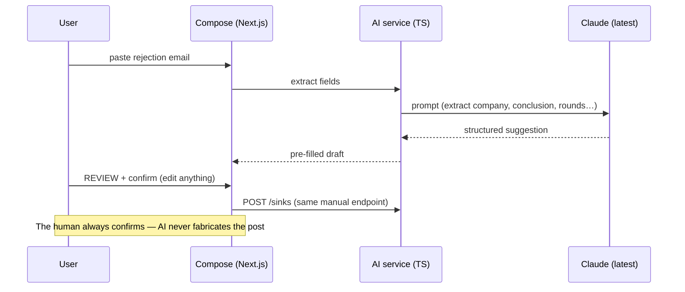
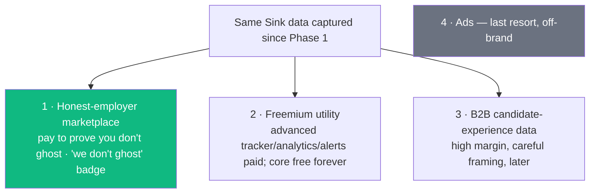

# Phase 6+ — AI & monetization ⬜ (gated, deliberately last)

← [Phase 5](phase-5-growth-mechanics.md) · [Index](README.md)

> **Goal:** make it smarter (AI) and sustainable (revenue). **Additive on a *validated* product** — AI adds cost, complexity, and failure surface; monetization needs scale + trust to work without betraying users. Both come last on purpose.
>
> **Entry gate:** a proven, retained, growing product with trust signals (Phases 1–4 gates all passed).

## What the user can newly do
Get an instant **AI roast/commiseration** on a rejection · **auto-fill a Sink** by pasting the rejection email (AI extracts fields; you confirm) · **decode corporate-speak** ("your experience more closely aligns" → the honest meaning) · (power users) pay for deeper tools · (companies) participate honestly and earn a "we don't ghost" badge.

---

## The AI layer `[in-plan]` — additive, never authoritative

Drops **on top of** the existing manual schema — the manual compose form stays as the fallback, so there's **no rework**. Uses the **latest Claude models** (Anthropic) — this is the project's natural AI/Anthropic milestone.

**AI features:** the roast (instant commiseration), the corporate-speak translator, compose auto-fill. **Guardrail:** AI must never fabricate a user's experience — pre-fill + user confirmation only; the human owns the post. Add cost controls, rate limits, and graceful degradation (feature fails → manual form still works).

---

## Monetization — ranked by brand fit `[in-plan]`

1. **Honest-employer marketplace** — companies pay to prove they *don't* ghost (verified-responsive listings + a "we don't ghost" badge). **Aligned incentives; free users untouched.** Best brand fit.
2. **Freemium utility** — advanced tracker/analytics/alerts paid; the **cathartic core free forever.**
3. **B2B candidate-experience data** — high margin, careful framing, later.
4. **Ads** — last resort, off-brand for a "no-tracking, honest" product.

All paths run on the **same Sink data captured since Phase 1** — which is *why* clean, structured data from day one mattered. Payments via **Stripe** (TypeScript SDK); **employer** is a distinct account role.

---

## Data model additions
`EmployerAccount(orgName, domain, verified)` · `EmployerBadge(orgDomain, kind "NO_GHOST", grantedAt)` · billing records (Stripe customer/subscription) · AI usage/cost ledger (`AiUsage(userId, feature, tokens, costCents)`).

## Tradeoffs & decisions
- **AI must never fabricate experience** — confirmation-gated pre-fill only.
- **Never paywall the cathartic core** — the free vent-and-community *is* the soul; only advanced utilities are paid.
- **Employer accounts change the trust model** — the pseudonymous user side stays sacrosanct; employers see aggregate/opt-in data, **never** de-anonymized users.
- **AI cost control** — cache, rate-limit, degrade gracefully; watch unit economics before scaling any AI feature.

## Safety this phase
Confirmation-gated AI; strict separation of employer view from user identity; billing/PCI handled by Stripe; AI abuse + cost guards.

## Exit gate
Sustainable revenue **without** an ad or paywall in front of the free cathartic core, and **without** betraying user trust.

---

## Trademark reminder
Resolve the IP-lawyer conversation **before** this phase's commercial weight (ideally sooner). Keep "anti-LinkedIn" as internal compass only — never public branding.
